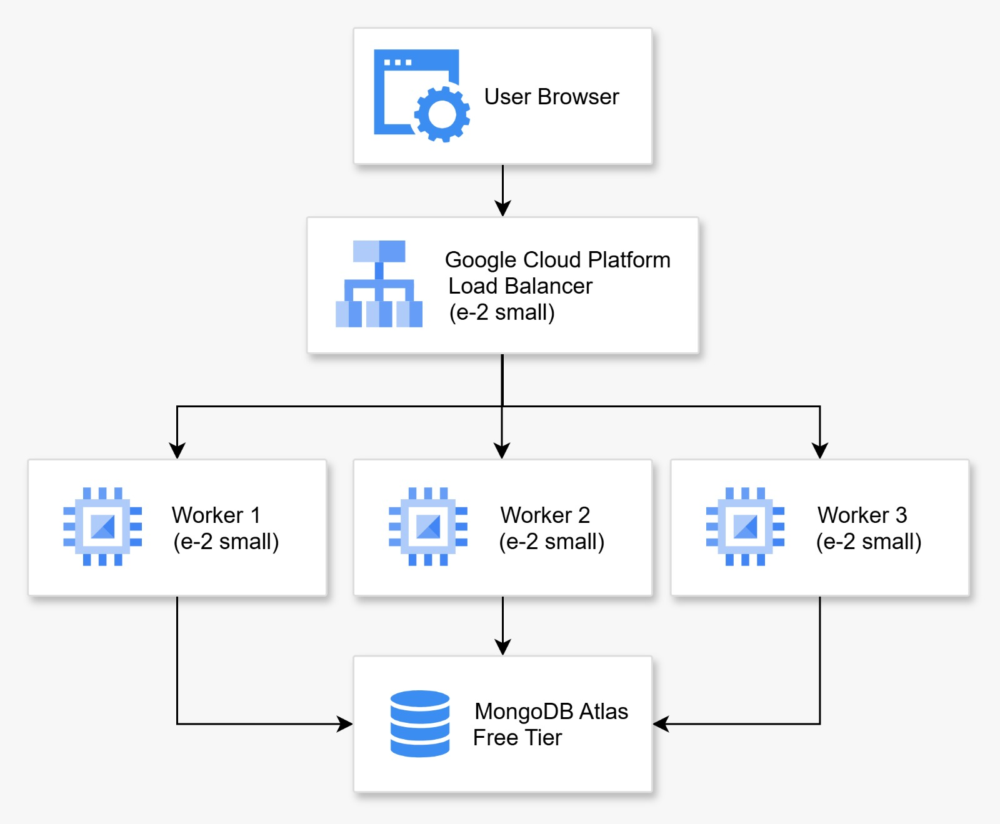

# 📘 Laporan Final Project Teknologi Komputasi Awan

## 👥 Kelompok 1  
**Anggota:**
| NRP | Nama | Tugas |
| ------ | ------ | ------ |
| 5027211032 | Aqila Aqsa | Merancang arsitektur cloud dan testing aplikasi (front-end & back-end) |
| 5027211049 | Tridiktya Hardani Putra | Implementasi/setup arsitektur dan deployment aplikasi |
| 5027221045 | Gilang Raya Kurniawan | Setup Locust dan load testing |
| 5027221063 | Salomo | Setup Locust dan load testing |
| 5027221072 | Zidny Ilman Nafi'an | Setup Locust dan load testing |

---

## 📌 (1) Deskripsi Final Project

Anda adalah seorang lulusan Teknologi Informasi. Sebagai ahli IT, salah satu kemampuan yang harus dimiliki adalah kemampuan merancang, membangun, dan mengelola aplikasi berbasis komputer menggunakan layanan cloud untuk memenuhi kebutuhan organisasi.

Pada suatu saat Anda mendapatkan proyek dari departemen untuk mendeploy sebuah aplikasi **Absen berbasis Face Recognition**, dengan komponen:
- **Backend**: Python FastAPI  
- **Frontend**: ReactJS  

Spesifikasi aplikasi tersedia di repositori berikut:  
🔗 [https://github.com/fuaddary/fp-cloud-2025](https://github.com/fuaddary/fp-cloud-2025)

Anda diminta untuk mendesain arsitektur cloud yang sesuai dengan kebutuhan aplikasi tersebut.  
**Batas anggaran: 100 USD**

---

## ☁️ Lingkungan Cloud yang Dipilih

**Google Cloud Platform (GCP)**

---

## 📝 Tugas dan Penilaian

### 🔹 Arsitektur & Biaya (20%)
- Mendesain arsitektur cloud lengkap
- Menghitung dan menjelaskan estimasi harga VM dan komponen lainnya  
- Dipresentasikan pada minggu ke-15

### 🔹 Implementasi & Deployment (20%)
- Instalasi aplikasi sesuai spesifikasi arsitektur
- Pastikan semua endpoint berjalan dengan baik

### 🔹 Load Testing dengan Locust (35%)
- Fokus pada endpoint `/recognize-face` dalam mode kiosk
- Locust dijalankan dari komputer/host yang berbeda dari aplikasi
- Tujuan pengujian:
  - Menentukan jumlah maksimal pengguna tanpa error
  - Membandingkan jumlah user dengan response time

- **Jumlah user yang diuji:**
  - 1, 3, 5, 10, 15, 20, 30 user

### 🔹 Dokumentasi GitHub (25%)
1. **Introduction**  
   Penjelasan masalah dan latar belakang

2. **Desain Arsitektur Cloud**  
   - Gambar desain arsitektur (dapat menggunakan [https://app.diagrams.net/](https://app.diagrams.net/))  
   - Tabel spesifikasi VM dan estimasi biaya

3. **Langkah Implementasi dan Konfigurasi**  
   - Load balancing  
   - Instalasi `app.py`, MongoDB, dan lainnya  
   - Sertakan screenshot jika memungkinkan

4. **Pengujian API dan Antarmuka**  
   - Uji endpoint aplikasi
   - Tampilkan antarmuka aplikasi

5. **Load Testing & Analisis**  
   - Hasil uji Locust  
   - Analisis performa dan bottleneck

6. **Kesimpulan dan Saran**  
   - Evaluasi akhir proyek  
   - Rekomendasi perbaikan atau optimasi

---

## (2) 📐 Rancangan Arsitektur Cloud

**Diagram Arsitektur V1:**



## 💰 Tabel Perkiraan Biaya Bulanan

| **Komponen**                             | **Jumlah / Unit**     | **Total Bulanan** |
|-----------------------------------------|------------------------|-------------------|
| Compute Engine (e2-small, 2 vCPU, 2GB)  | 1 VM (Load Balancer)   | $13.73            |
| Compute Engine (e2-small, 2 vCPU, 2GB)  | 1 VM (Worker 1)        | $13.73            |
| Compute Engine (e2-small, 2 vCPU, 2GB)  | 1 VM (Worker 2)        | $13.73            |
| Compute Engine (e2-small, 2 vCPU, 2GB)  | 1 VM (Worker 3)        | $13.73            |
| MongoDB Atlas (Free Tier)               | 1 Cluster              | $0.00             |
| **Total**                               |                        | **$54.92**        |

---

**Diagram Arsitektur V2 (Scale-Out Vertikal):**


## 💰 Tabel Perkiraan Biaya Bulanan

| **Komponen**                             | **Jumlah / Unit**     | **Total Bulanan** |
|-----------------------------------------|------------------------|-------------------|
| Compute Engine (e2-small, 2 vCPU, 2GB)  | 1 VM (Load Balancer)   | $13.73            |
| Compute Engine (e2-medium, 2 vCPU, 4GB) | 1 VM (Worker 1)        | $25.46            |
| Compute Engine (e2-medium, 2 vCPU, 4GB) | 1 VM (Worker 2)        | $25.46            |
| Compute Engine (e2-medium, 2 vCPU, 4GB) | 1 VM (Worker 3)        | $25.46            |
| MongoDB Atlas (Free Tier)               | 1 Cluster              | $0.00             |
| **Total**                               |                        | **$90.11**        |


## (4) Pengujian API dan Antarmuka

---

### 🔹 Uji Endpoint Aplikasi

Endpoint backend diuji menggunakan **Swagger UI** (untuk endpoint terdokumentasi) dan **Thunder Client** (untuk endpoint tambahan seperti login admin). Semua endpoint berjalan pada backend FastAPI dan terkoneksi dengan MongoDB di VM worker.

---

### 📘 A. Endpoint yang Diuji via Swagger UI Docs di ```http://34.69.220.138:8000/docs```

### 🔹 Uji Endpoint Aplikasi

#### 1. `GET /api/attendance/mode` – Get Attendance Mode  
> 📸 Swagger UI - Get current attendance mode based on time and schedule

> 

#### 2. `GET /` – Root  
> 📸 Swagger UI - Root Endpoint  

> 

#### 3. `GET /api/config` – Get Config  
> 📸 Swagger UI - Get current DeepFace configuration

> 

#### 4. `POST /api/config` – Update Config  
> 📸 Swagger UI - Update DeepFace configuration 

> 

#### 5. `GET /api/models` – Get Available Models  
> 📸 Swagger UI - Get available DeepFace models and settings

> 

#### 6. `POST /api/recognize-face` – Recognize Face  
> 📸 Swagger UI - Recognize face from uploaded image

> 

#### 7. `POST /api/attendance` – Record Attendance  
> 📸 Swagger UI - Record attendance for an employee with optional captured image 

> 

#### 8. `GET /api/attendance` – Get Attendance History  
> 📸 Swagger UI - Get attendance history with timezone conversion

> 

#### 9. `GET /api/employees` – Get Employees  
> 📸 Swagger UI - Get all employees

> 

#### 10. `POST /api/employees/enroll` – Enroll Employee  
> 📸 Swagger UI - Enroll a new employee with their face

> 

#### 11. `DELETE /api/employees/{employee_id}` – Delete Employee  
> 📸 Swagger UI - Delete an employee and their face data

> 

#### 12. `PUT /api/employees/{employee_id}` – Update Employee  
> 📸 Swagger UI - Update employee information

> 

#### 13. `GET /api/employees/{employee_id}/photo` – Get Employee Photo  
> 📸 Swagger UI - Get employee profile photo

> 

#### 14. `GET /api/attendance/{attendance_id}/photo` – Get Attendance Photo  
> 📸 Swagger UI - Get attendance captured photo

> 
> 

#### 15. `GET /health` – Health Check  
> 📸 Swagger UI - Health check endpoint

> 

#### 16. `POST /api/debug-face` – Debug Face Recognition  
> 📸 Swagger UI - Debug face recognition - shows detailed information about the process

> 

---

### 🖥️ C. Tampilkan Antarmuka Aplikasi

Berikut hasil tangkapan layar (screenshot) antarmuka frontend aplikasi saat digunakan.

> 📸 **1. Halaman Login Admin**

> 

> 📸 **2. Fitur Kamera dan Statistik Admin**

> 

> 📸 **3. Manajemen Karyawan (Users Tab)**

> 

> 📸 **4. Tambah Karyawan - Step 1 (Data)**

> 

> 📸 **5. Tambah Karyawan - Step 2 (Ambil Foto)**

> 

> 📸 **6. Tambah Karyawan - Step 3 (Review Data)**

> 

> 📸 **7. Kiosk Mode**

> 

> 📸 **8. Admin History**

> 

> 📸 **9. Pengaturan Model Face Recognition**       

> 

---

### 📂 Tabel Ringkasan Endpoint

### 📄 Ringkasan Endpoint API

| No. | Method | Endpoint                                | Deskripsi                      |
|-----|--------|------------------------------------------|-------------------------------|
| 1   | GET    | /api/attendance/mode                     | Get Attendance Mode           |
| 2   | GET    | /                                        | Root                          |
| 3   | GET    | /api/config                              | Get Config                    |
| 4   | POST   | /api/config                              | Update Config                 |
| 5   | GET    | /api/models                              | Get Available Models          |
| 6   | POST   | /api/recognize-face                      | Recognize Face                |
| 7   | POST   | /api/attendance                          | Record Attendance             |
| 8   | GET    | /api/attendance                          | Get Attendance History        |
| 9   | GET    | /api/employees                           | Get Employees                 |
| 10  | POST   | /api/employees/enroll                    | Enroll Employee               |
| 11  | DELETE | /api/employees/{employee_id}             | Delete Employee               |
| 12  | PUT    | /api/employees/{employee_id}             | Update Employee               |
| 13  | GET    | /api/employees/{employee_id}/photo       | Get Employee Photo            |
| 14  | GET    | /api/attendance/{attendance_id}/photo    | Get Attendance Photo          |
| 15  | GET    | /health                                  | Health Check                  |
| 16  | POST   | /api/debug-face                          | Debug Face Recognition        |

---

Semua endpoint dan tampilan diuji pada sistem yang sudah dideploy di Google Cloud Platform dengan database MongoDB yang berjalan di VM worker.

# (5) Pengujian Load Testing

Setelah aplikasi berhasil di deploy, kami melakukan pengujian dengna menggunakn locust untuk Menentukan jumlah maksimal pengguna tanpa error Membandingkan jumlah user dengan response time, percobaan dilakukan di alamat API
http://34.69.220.138:8000/api/recognize-face dengan metode POST 

#### 1. Pertama kami melakukan pengujian load Testing dengan menggunakan satu user dan maksimal user adalah satu


DIdapat kesimpulan dari gambar bahwa
   - Server Lancar
   - Response time juga masih aman

#### 2. Kedua kami melakukan pengujian dengan user sebanyak 5


DIdapat kesimpulan dari gambar bahwa
   - Server masih Aman
   - Response time juga masih aman seperti percobaan pertama


#### 3. Ketiga Percobaan kami menggunakan user sebanyak 10


DIdapat kesimpulan bahwa
   - Server masih aman juga
   - Response time juga masih lancar tidak menunjukan perubahan pada "ms" nya
