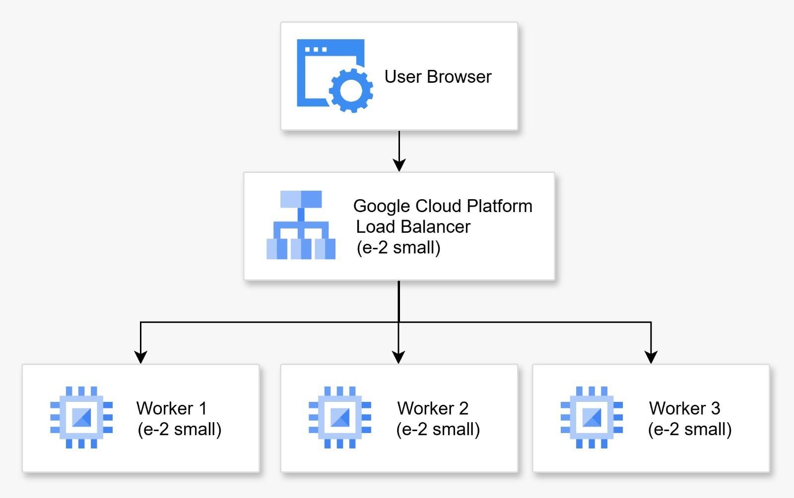
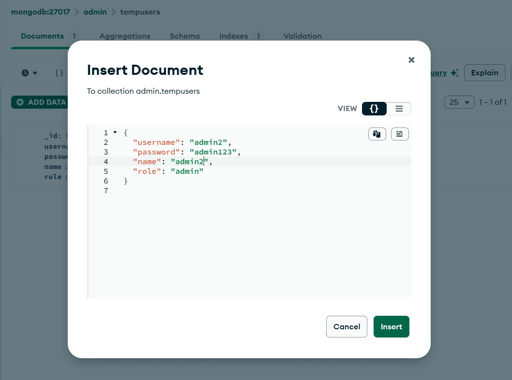
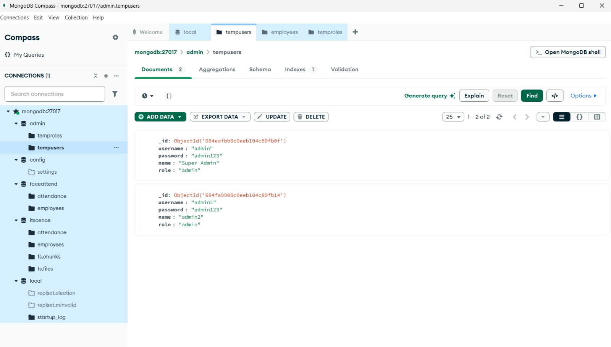

# 📘 Laporan Final Project Teknologi Komputasi Awan

## 👥 Kelompok 1  
**Anggota:**  
- Aqila Aqsa (5027211032)  
- Tridiktya Hardani Putra (5027211049)  

---

## 📌 (1) Deskripsi Final Project

Anda adalah seorang lulusan Teknologi Informasi. Sebagai ahli IT, salah satu kemampuan yang harus dimiliki adalah kemampuan merancang, membangun, dan mengelola aplikasi berbasis komputer menggunakan layanan cloud untuk memenuhi kebutuhan organisasi.

Pada suatu saat Anda mendapatkan proyek dari departemen untuk mendeploy sebuah aplikasi **Absen berbasis Face Recognition**, dengan komponen:
- **Backend**: Python FastAPI  
- **Frontend**: ReactJS  

Spesifikasi aplikasi tersedia di repositori berikut:  
🔗 [https://github.com/fuaddary/fp-cloud-2025](https://github.com/fuaddary/fp-cloud-2025)

Anda diminta untuk mendesain arsitektur cloud yang sesuai dengan kebutuhan aplikasi tersebut.  
**Batas anggaran: 100 USD**

---

## ☁️ Lingkungan Cloud yang Dipilih

**Google Cloud Platform (GCP)**

---

## 📝 Tugas dan Penilaian

### 🔹 Arsitektur & Biaya (20%)
- Mendesain arsitektur cloud lengkap
- Menghitung dan menjelaskan estimasi harga VM dan komponen lainnya  
- Dipresentasikan pada minggu ke-15

### 🔹 Implementasi & Deployment (20%)
- Instalasi aplikasi sesuai spesifikasi arsitektur
- Pastikan semua endpoint berjalan dengan baik

### 🔹 Load Testing dengan Locust (35%)
- Fokus pada endpoint `/recognize-face` dalam mode kiosk
- Locust dijalankan dari komputer/host yang berbeda dari aplikasi
- Tujuan pengujian:
  - Menentukan jumlah maksimal pengguna tanpa error
  - Membandingkan jumlah user dengan response time

- **Jumlah user yang diuji:**
  - 1, 3, 5, 10, 15, 20, 30 user

### 🔹 Dokumentasi GitHub (25%)
1. **Introduction**  
   Penjelasan masalah dan latar belakang

2. **Desain Arsitektur Cloud**  
   - Gambar desain arsitektur (dapat menggunakan [https://app.diagrams.net/](https://app.diagrams.net/))  
   - Tabel spesifikasi VM dan estimasi biaya

3. **Langkah Implementasi dan Konfigurasi**  
   - Load balancing  
   - Instalasi `app.py`, MongoDB, dan lainnya  
   - Sertakan screenshot jika memungkinkan

4. **Pengujian API dan Antarmuka**  
   - Uji endpoint aplikasi
   - Tampilkan antarmuka aplikasi

5. **Load Testing & Analisis**  
   - Hasil uji Locust  
   - Analisis performa dan bottleneck

6. **Kesimpulan dan Saran**  
   - Evaluasi akhir proyek  
   - Rekomendasi perbaikan atau optimasi

---

## (2) 📐 Rancangan Arsitektur Cloud

**Diagram Arsitektur:**

---

## 💰 Tabel Perkiraan Biaya Bulanan

| **Komponen**                            | **Jumlah / Unit** | **Harga per Unit (per bulan)** | **Total Bulanan** |
|----------------------------------------|-------------------|-------------------------------|-------------------|
| Compute Engine (e2-small, 2 vCPU, 2GB) | 1 VM (Load Balancer) | $13.93                        | $13.93            |
| Compute Engine (e2-small, 2 vCPU, 2GB) | 1 VM (Worker 1)       | $20.73                        | $20.73            |
| Compute Engine (e2-small, 2 vCPU, 2GB) | 1 VM (Worker 2)       | $20.73                        | $20.73            |
| Compute Engine (e2-small, 2 vCPU, 2GB) | 1 VM (Worker 3)       | $20.73                        | $20.73            |
| **Total**                              |                     |                               | **$76.12**        |

---

## (4) Pengujian API dan Antarmuka

---

### 🔹 Uji Endpoint Aplikasi

Endpoint backend diuji menggunakan **Swagger UI** (untuk endpoint terdokumentasi) dan **Thunder Client** (untuk endpoint tambahan seperti login admin). Semua endpoint berjalan pada backend FastAPI dan terkoneksi dengan MongoDB di VM worker.

---

### 📘 A. Endpoint yang Diuji via Swagger UI

#### 1. `POST /employee/` – Tambah Karyawan

> 📸 Swagger UI - Tambah Karyawan
> 

#### 2. `GET /employee/` – Ambil Semua Karyawan

> 📸 Swagger UI - Lihat Semua Karyawan
> 

#### 3. `GET /employee/{id}` – Detail Karyawan

#### 4. `PUT /employee/{id}` – Edit Karyawan

#### 5. `DELETE /employee/{id}` – Hapus Karyawan

#### 6. `POST /face/register` – Register Wajah

> 📸 Swagger UI - Register Wajah
> 

#### 7. `POST /face/recognize` – Deteksi Wajah

> 📸 Swagger UI - Recognize Face
> 

#### 8. `POST /attendance/checkin` – Absen Masuk

#### 9. `POST /attendance/checkout` – Absen Keluar

#### 10. `GET /attendance` – Semua Data Absensi

> 📸 Swagger UI - Riwayat Absensi
> 

#### 11. `GET /attendance/{employee_id}` – Riwayat Absensi Karyawan

---

### 📙 B. Endpoint Tambahan via Thunder Client/Lainnya

#### 12. `POST /admin/login` – Login Admin

Digunakan untuk autentikasi admin. Mengembalikan token JWT.

> 📸 Thunder Client - Login Admin
> 

#### 13. `MongoDB Connection` – Register Admin

Menambahkan akun admin baru ke sistem.

> 📸 Thunder Client - Register Admin
> 
> 

---

### 🖥️ C. Tampilkan Antarmuka Aplikasi

Berikut hasil tangkapan layar (screenshot) antarmuka frontend aplikasi saat digunakan.

> 📸 **1. Halaman Login Admin**
> 

> 📸 **2. Fitur Kamera dan Statistik Admin**
> 

> 📸 **3. Manajemen Karyawan (Users Tab)**
> 

> 📸 **4. Tambah Karyawan - Step 1 (Data)**
> 

> 📸 **5. Tambah Karyawan - Step 2 (Ambil Foto)**
> 

> 📸 **6. Kiosk Mode**
> 

> 📸 **7. Admin History**
> 

> 📸 **8. Pengaturan Model Face Recognition**       
> 

---

### 📂 Tabel Ringkasan Endpoint

| Endpoint                    | Method | Deskripsi                       | Tools          |
| --------------------------- | ------ | ------------------------------- | -------------- |
| `/admin/login`              | POST   | Login admin                     | Thunder Client |
| `/admin/`                   | POST   | Tambah admin baru               | Thunder Client |
| `/employee/`                | POST   | Tambah karyawan                 | Swagger        |
| `/employee/`                | GET    | Ambil semua karyawan            | Swagger        |
| `/employee/{id}`            | GET    | Detail karyawan                 | Swagger        |
| `/employee/{id}`            | PUT    | Edit data karyawan              | Swagger        |
| `/employee/{id}`            | DELETE | Hapus data karyawan             | Swagger        |
| `/face/register`            | POST   | Upload wajah (base64)           | Swagger        |
| `/face/recognize`           | POST   | Deteksi wajah dari gambar       | Swagger        |
| `/attendance/checkin`       | POST   | Catat absen masuk               | Swagger        |
| `/attendance/checkout`      | POST   | Catat absen keluar              | Swagger        |
| `/attendance`               | GET    | Lihat semua absensi             | Swagger        |
| `/attendance/{employee_id}` | GET    | Lihat absensi karyawan tertentu | Swagger        |

---

Semua endpoint dan tampilan diuji pada sistem yang sudah dideploy di Google Cloud Platform dengan database MongoDB yang berjalan di VM worker.

