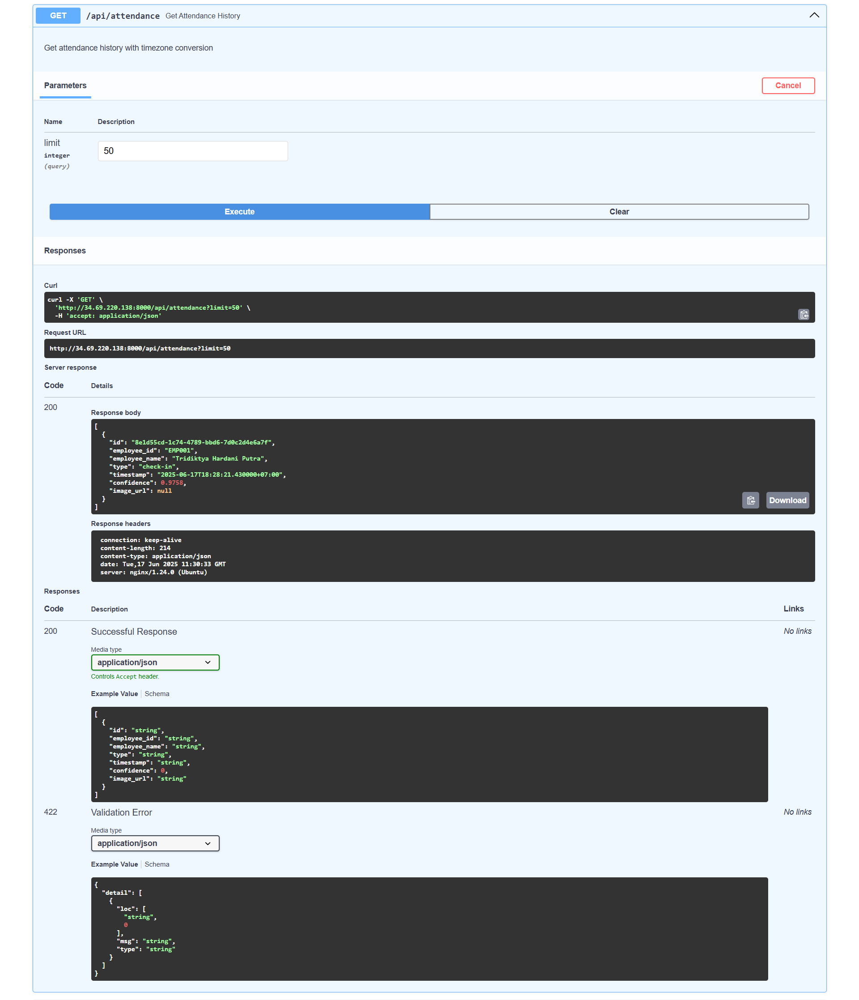
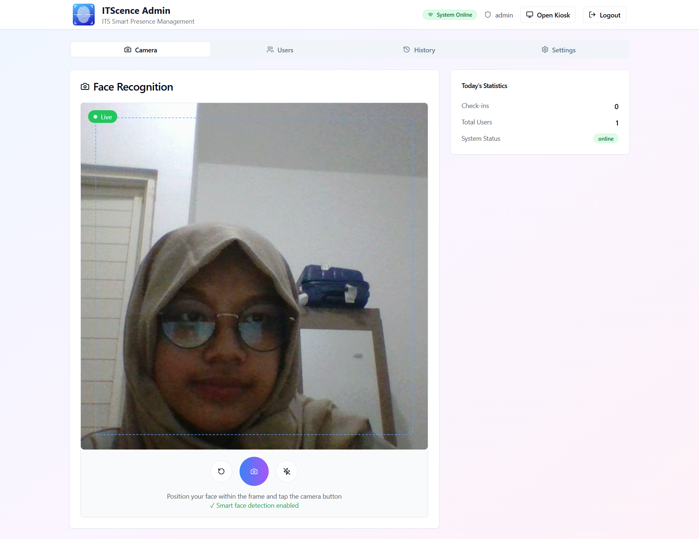

# 📘 Laporan Final Project Teknologi Komputasi Awan

## 👥 Kelompok 1  
**Anggota:**
| NRP | Nama | Tugas |
| ------ | ------ | ------ |
| 5027211032 | Aqila Aqsa | Merancang arsitektur cloud dan testing aplikasi (front-end & back-end) |
| 5027211049 | Tridiktya Hardani Putra | Implementasi/setup arsitektur dan deployment aplikasi |
| 5027221045 | Gilang Raya Kurniawan | Setup Locust dan load testing |
| 5027221063 | Salomo | Setup Locust dan load testing |
| 5027221072 | Zidny Ilman Nafi'an | Setup Locust dan load testing |

---

## 📌 (1) Deskripsi Final Project

Anda adalah seorang lulusan Teknologi Informasi. Sebagai ahli IT, salah satu kemampuan yang harus dimiliki adalah kemampuan merancang, membangun, dan mengelola aplikasi berbasis komputer menggunakan layanan cloud untuk memenuhi kebutuhan organisasi.

Pada suatu saat Anda mendapatkan proyek dari departemen untuk mendeploy sebuah aplikasi **Absen berbasis Face Recognition**, dengan komponen:
- **Backend**: Python FastAPI  
- **Frontend**: ReactJS  

Spesifikasi aplikasi tersedia di repositori berikut:  
🔗 [https://github.com/fuaddary/fp-cloud-2025](https://github.com/fuaddary/fp-cloud-2025)

Anda diminta untuk mendesain arsitektur cloud yang sesuai dengan kebutuhan aplikasi tersebut.  
**Batas anggaran: 100 USD**

---

## ☁️ Lingkungan Cloud yang Dipilih

**Google Cloud Platform (GCP)**

---

## 📝 Tugas dan Penilaian

### 🔹 Arsitektur & Biaya (20%)
- Mendesain arsitektur cloud lengkap
- Menghitung dan menjelaskan estimasi harga VM dan komponen lainnya  
- Dipresentasikan pada minggu ke-15

### 🔹 Implementasi & Deployment (20%)
- Instalasi aplikasi sesuai spesifikasi arsitektur
- Pastikan semua endpoint berjalan dengan baik

### 🔹 Load Testing dengan Locust (35%)
- Fokus pada endpoint `/recognize-face` dalam mode kiosk
- Locust dijalankan dari komputer/host yang berbeda dari aplikasi
- Tujuan pengujian:
  - Menentukan jumlah maksimal pengguna tanpa error
  - Membandingkan jumlah user dengan response time

- **Jumlah user yang diuji:**
  - 1, 3, 5, 10, 15, 20, 30 user

### 🔹 Dokumentasi GitHub (25%)
1. **Introduction**  
   Penjelasan masalah dan latar belakang

2. **Desain Arsitektur Cloud**  
   - Gambar desain arsitektur (dapat menggunakan [https://app.diagrams.net/](https://app.diagrams.net/))  
   - Tabel spesifikasi VM dan estimasi biaya

3. **Langkah Implementasi dan Konfigurasi**  
   - Load balancing  
   - Instalasi `app.py`, MongoDB, dan lainnya  
   - Sertakan screenshot jika memungkinkan

4. **Pengujian API dan Antarmuka**  
   - Uji endpoint aplikasi
   - Tampilkan antarmuka aplikasi

5. **Load Testing & Analisis**  
   - Hasil uji Locust  
   - Analisis performa dan bottleneck

6. **Kesimpulan dan Saran**  
   - Evaluasi akhir proyek  
   - Rekomendasi perbaikan atau optimasi

---

## (2) 📐 Rancangan Arsitektur Cloud

**Diagram Arsitektur V1:**


## 💰 Tabel Perkiraan Biaya Bulanan

| **Komponen**                            | **Jumlah / Unit**      | **Spesifikasi**                                                | **Total Bulanan** |
|-----------------------------------------|------------------------|----------------------------------------------------------------|-------------------|
| Compute Engine (e2-small)               | 1 VM (Load Balancer)   | 2 vCPU (1 shared), 2GB RAM, 10GB SSD, Ubuntu 24.04 (x86_64)    | $13.93            |
| Compute Engine (e2-medium)              | 1 VM (Worker 1)        | 2 vCPU (1 shared), 4GB RAM, 15GB Balanced, Ubuntu 24.04 (x86_64)| $25.96            |
| Compute Engine (e2-medium)              | 1 VM (Worker 2)        | 2 vCPU (1 shared), 4GB RAM, 15GB Balanced, Ubuntu 24.04 (x86_64)| $25.96            |
| Compute Engine (e2-medium)              | 1 VM (Worker 3)        | 2 vCPU (1 shared), 4GB RAM, 15GB Balanced, Ubuntu 24.04 (x86_64)| $25.96            |
| MongoDB Atlas (Free Tier)               | 1 Cluster              | Shared vCPU and RAM, ~512MB storage (Free Tier)            | $0.00             |
| **Total**                               |                        |                                                                | **$91.81**        |


---

**Diagram Arsitektur V2 (Scale-Out Vertikal):**


## 💰 Tabel Perkiraan Biaya Bulanan

| **Komponen**                            | **Jumlah / Unit**      | **Spesifikasi**                                                 | **Total Bulanan** |
|-----------------------------------------|------------------------|------------------------------------------------------------------|-------------------|
| Compute Engine (e2-small)               | 1 VM (Load Balancer)   | 2 vCPU (1 shared), 2GB RAM, 10GB SSD, Ubuntu 24.04 (x86_64)      | $13.93            |
| Compute Engine (e2-custom-2-4608)       | 1 VM (Worker 1)        | 2 vCPU (1 core), 4.5GB RAM, 15GB Balanced, Ubuntu 24.04 (x86_64) | $42.95            |
| Compute Engine (e2-custom-2-4608)       | 1 VM (Worker 2)        | 2 vCPU (1 core), 4.5GB RAM, 15GB Balanced, Ubuntu 24.04 (x86_64) | $42.95            |
| MongoDB Atlas (Free Tier)               | 1 Cluster              | Shared vCPU and RAM, ~512MB storage (Free Tier)              | $0.00             |
| **Total**                               |                        |                                                                  | **$99.83**        |

---

**Diagram Arsitektur V3 Revisi (Menggunakan Powerful CPU):**


## 💰 Tabel Perkiraan Biaya Bulanan

| **Komponen**                  | **Jumlah / Unit**    | **Spesifikasi**                                                | **Total Bulanan** |
|------------------------------|----------------------|-----------------------------------------------------------------|-------------------|
| Compute Engine (n2-highcpu-4) | 1 VM (App Server)     | 4 vCPU (2 core), 4GB RAM, 15GB Balanced Disk, Ubuntu 24.04      | $85.24            |
| MongoDB Atlas (Free Tier)     | 1 Cluster             | Shared vCPU dan RAM, ~512MB storage (Free Tier)                 | $0.00             |
| **Total**                     |                      |                                                                 | **$85.24**        |

## 🛠️ (3) Implementasi dan Konfigurasi

---

### 🔹 Membuat dan Konfigurasi Instance GCP (Google Compute Engine VM)
#### Memilih Spesifikasi di Compute Engine
   Dilakukan pembuatan dan pemilihan spesifikasi VM untuk load balancer dan worker.

   

#### Konfigurasi Firewall Policy
   Membuat firewall policy untuk mengizinkan traffic HTTP dan HTTPS pada port 80, 443, 8000, dan 9090. Port 80 dan 443 sudah diatur secara default, sehingga hanya perlu menambahkan port 8000 dan 9090 untuk aplikasi.

   

   Dilakukan hal yang sama untuk port 9090.

### 🔹 Setup MongoDB Atlas Cluster
#### Membuat User MongoDB Atlas
   Membuat user MongoDB Atlas dengan role `Read and Write to any database` untuk mengizinkan user/aplikasi melakukan operasi baca dan tulis pada database.

   
#### Membuat Cluster MongoDB Atlas
   Dilakukan pembuatan cluster MongoDB Atlas dengan spesifikasi free.

   

#### Mengatur IP Whitelist
   Mengatur IP whitelist pada MongoDB Atlas untuk mengizinkan akses dari jaringan eksternal.

   

### 🔹 Setup Load Balancer
#### Instalasi Nginx
   Dilakukan instalasi Nginx yang berfungsi sebagai load balancer untuk mendistribusikan traffic ke VM worker. Instalasi dilakukan dengan perintah berikut:

   ```bash
   sudo apt update && sudo apt upgrade -y
   sudo apt install nginx -y
   ```

#### Konfigurasi Nginx
   Setelah instalasi, konfigurasi Nginx dilakukan pada file `/etc/nginx/nginx.conf` untuk mengarahkan traffic ke VM worker.

   ```nginx
   user www-data;
   worker_processes auto;
   pid /run/nginx.pid;
   error_log /var/log/nginx/error.log;
   include /etc/nginx/modules-enabled/*.conf;

   events {
         worker_connections 768;
         # multi_accept on;
   }

   http {
         upstream backend {
                  least_conn;
                  server 10.128.0.3:8000; # IP Internal VM Worker 1
                  server 10.128.0.4:8000;  # IP Internal VM Worker 2
                  server 10.128.0.5:8000;   # IP Internal VM Worker 3
         }

         server {
                  listen 8000;
                  server_name localhost;

                  location / {
                           proxy_pass http://backend;
                  }
         }
         ##
         # Basic Settings
         ##

         sendfile on;
         tcp_nopush on;
         types_hash_max_size 2048;
         # server_tokens off;

         # server_names_hash_bucket_size 64;
         # server_name_in_redirect off;

         include /etc/nginx/mime.types;
         default_type application/octet-stream;

         ##
         # SSL Settings
         ##

         ssl_protocols TLSv1 TLSv1.1 TLSv1.2 TLSv1.3; # Dropping SSLv3, ref: POODLE
         ssl_prefer_server_ciphers on;

         ##
         # Logging Settings
         ##

         access_log /var/log/nginx/access.log;

         ##
         # Gzip Settings
         ##

         gzip on;

         # gzip_vary on;
         # gzip_proxied any;
         # gzip_comp_level 6;
         # gzip_buffers 16 8k;
         # gzip_http_version 1.1;
         # gzip_types text/plain text/css application/json application/javascript text/xml application/xml application/xml+rss text/javascript;

         ##
         # Virtual Host Configs
         ##

         include /etc/nginx/conf.d/*.conf;
         include /etc/nginx/sites-enabled/*;
   }
   ```

### 🔹  Modifikasi Setup dan Konfigurasi Aplikasi
#### Modifikasi Script Dockerfile Front-End
Modifikasi dilakukan pada Dockerfile frontend untuk menambahkan sertifikat SSL dan mengonfigurasi Nginx dari front-end agar dapat diakses dengan HTTPS. Hal ini bertujuan agar kamera dapat dibuka di browser.

```Dockerfile
# FaceAttend Frontend Dockerfile
# ===============================

# Stage 1: Build stage
FROM node:18-alpine AS builder

# Set working directory
WORKDIR /app

# Copy package files
COPY package*.json ./

# Install all dependencies (including devDependencies needed for build)
RUN npm ci

# Copy source code
COPY . .

# Build the application
RUN npm run build

# Stage 2: Production stage
FROM nginx:alpine

# Copy built assets from builder stage
COPY --from=builder /app/dist /usr/share/nginx/html

RUN apk add --no-cache openssl nginx

RUN mkdir -p /etc/ssl/private /etc/ssl/certs && \
    openssl req -x509 -nodes -days 365 -newkey rsa:2048 \
    -keyout /etc/ssl/private/nginx-selfsigned.key \
    -out /etc/ssl/certs/nginx-selfsigned.crt \
    -subj "/C=US/ST=State/L=City/O=Organization/OU=Unit/CN=localhost" && \
    chmod 700 /etc/ssl/private/nginx-selfsigned.key

# Copy custom nginx configuration
COPY nginx.conf /etc/nginx/conf.d/default.conf

# Expose port 443 and 80 (http)
EXPOSE 80 443

# Health check
HEALTHCHECK --interval=30s --timeout=3s --start-period=5s --retries=3 \
    CMD wget --no-verbose --tries=1 --spider http://localhost/ || exit 1

# Start nginx
CMD ["nginx", "-g", "daemon off;"]
```

#### Modifikasi Konfigurasi Nginx untuk Front-End
Hal ini dilakukan untuk memastikan bahwa aplikasi front-end dapat diakses melalui HTTPS dan kamera dapat berfungsi dengan baik di browser.

```nginx
server {
    listen 9090;
    server_name _;
    return 301 https://$host$request_uri;
}

server {
    listen 443 ssl;
    server_name _;

    ssl_certificate /etc/ssl/certs/nginx-selfsigned.crt;
    ssl_certificate_key /etc/ssl/private/nginx-selfsigned.key;

    # Serve static files
    location / {
        root /usr/share/nginx/html;
        index index.html index.htm;
        try_files $uri $uri/ /index.html;
        
        # Security headers
        add_header X-Frame-Options "SAMEORIGIN" always;
        add_header X-Content-Type-Options "nosniff" always;
        add_header X-XSS-Protection "1; mode=block" always;
        
        # Cache static assets
        location ~* \.(js|css|png|jpg|jpeg|gif|ico|svg)$ {
            expires 1y;
            add_header Cache-Control "public, immutable";
        }
    }

    # Proxy API requests to backend
    location /api/ {
        proxy_pass http://backend:8000/api/;
        proxy_set_header Host $host;
        proxy_set_header X-Real-IP $remote_addr;
        proxy_set_header X-Forwarded-For $proxy_add_x_forwarded_for;
        proxy_set_header X-Forwarded-Proto $scheme;
        
        # Handle long requests (face recognition can take time)
        proxy_read_timeout 300s;
        proxy_connect_timeout 75s;
        proxy_send_timeout 300s;
        
        # Handle large file uploads (face images)
        client_max_body_size 10M;
    }

    # Health check endpoint
    location /health {
        proxy_pass http://backend:8000/health;
        proxy_set_header Host $host;
        proxy_set_header X-Real-IP $remote_addr;
    }

    # Error pages
    error_page 404 /index.html;
    error_page 500 502 503 504 /index.html;

    # Gzip compression
    gzip on;
    gzip_vary on;
    gzip_min_length 1024;
    gzip_proxied any;
    gzip_comp_level 6;
    gzip_types
        text/plain
        text/css
        text/xml
        text/javascript
        application/json
        application/javascript
        application/xml+rss
        application/atom+xml
        image/svg+xml;
} 
```

#### Modifikasi .env Back-End
File .env pada backend-example/.env disesuaikan untuk menghubungkan aplikasi dengan MongoDB Atlas yang telah dibuat sebelumnya. `MONGODB_URL` didapatkan dari MongoDB Atlas setelah membuat cluster dan user.

```env
# FaceAttend Backend Configuration
MONGODB_URL=mongodb+srv://admin:<password>@fp-tka.lgrnxza.mongodb.net
DATABASE_NAME=itscence
API_HOST=0.0.0.0
API_PORT=8000
DEFAULT_MODEL=VGG-Face
DEFAULT_DETECTOR=opencv
DEFAULT_DISTANCE_METRIC=cosine
FRONTEND_URL=http://frontend
# Logging
LOG_LEVEL=INFO
```

#### Modifikasi Script docker-compose.yml dan docker-compose.gpu.yml
Modifikasi dilakukan pada file `docker-compose.yml` untuk menyesuaikan dengan perubahan pada Dockerfile dan konfigurasi Nginx. Selain itu, environment pada script ini diubah menjadi `env_file` untuk mengambil konfigurasi dari file `.env` yang telah dibuat sebelumnya. 

```yaml
services:
  # MongoDB Database (Shared between CPU and GPU deployments)
  mongodb:
    image: mongo:7.0
    container_name: itscence-mongodb
    restart: unless-stopped
    environment:
      MONGO_INITDB_ROOT_USERNAME: admin
      MONGO_INITDB_ROOT_PASSWORD: password123
      MONGO_INITDB_DATABASE: itscence
    volumes:
      - mongodb_data:/data/db
      - ./mongodb-init:/docker-entrypoint-initdb.d
    ports:
      - "27017:27017"
    networks:
      - itscence-network
    healthcheck:
      test: ["CMD", "mongosh", "--eval", "db.adminCommand('ping')"]
      interval: 30s
      timeout: 10s
      retries: 3
      start_period: 30s

  # Backend API (CPU version)
  backend:
    build:
      context: ./backend-example
      dockerfile: Dockerfile
    container_name: itscence-backend
    restart: unless-stopped
    env_file:
      - ./backend-example/.env
    volumes:
      - ./backend-example/uploads:/app/uploads
      - ./backend-example/temp_images:/app/temp_images
      - ./backend-example/logs:/app/logs
      - ./backend-example/face_database:/app/face_database
    ports:
      - "8000:8000"
    # depends_on:
    #   mongodb:
    #     condition: service_healthy
    networks:
      - itscence-network
    healthcheck:
      test: ["CMD", "curl", "-f", "http://localhost:8000/health"]
      interval: 30s
      timeout: 10s
      retries: 3
      start_period: 60s

  # Frontend React App
  frontend:
    build:
      context: .
      dockerfile: Dockerfile
    container_name: itscence-frontend
    restart: unless-stopped
    ports:
      - "9090:443"
    depends_on:
      backend:
        condition: service_healthy
    networks:
      - itscence-network
    healthcheck:
      test: ["CMD", "wget", "--no-verbose", "--tries=1", "--spider", "http://localhost/"]
      interval: 30s
      timeout: 3s
      retries: 3
      start_period: 10s

volumes:
  mongodb_data:

networks:
  itscence-network:
    driver: bridge 
```

Setelah menyelesaikan semua modifikasi, dilakukan commit dan push ke [repository GitHub](https://github.com/trdkhardani/fp-cloud-2025/) untuk disimpan

### 🔹 Setup Workers
Setelah memodifikasi script dan konfigurasi, dilakukan setup pada VM worker untuk menjalankan aplikasi backend dan frontend.

#### Clone Repository
Dilakukan clone repository aplikasi ke dalam VM worker dengan perintah berikut:

```bash
git clone https://github.com/trdkhardani/fp-cloud-2025.git
```

#### Instalasi Docker
Instalasi Docker dilakukan pada VM worker untuk menjalankan aplikasi backend dan frontend. Di dalam direktori `/home/username/fp-cloud-2025/` terdapat script `install-docker.sh` yang dapat digunakan untuk menginstal Docker pada VM worker.Isi dari file tersebut adalah sebagai berikut:

```bash
#!/bin/bash

# uninstall all conflicting packages
for pkg in docker.io docker-doc docker-compose docker-compose-v2 podman-docker containerd runc; do sudo apt-get remove $pkg; done

# Add Docker's official GPG key:
sudo apt-get update
sudo apt-get install ca-certificates curl
sudo install -m 0755 -d /etc/apt/keyrings
sudo curl -fsSL https://download.docker.com/linux/ubuntu/gpg -o /etc/apt/keyrings/docker.asc
sudo chmod a+r /etc/apt/keyrings/docker.asc

# Add the repository to Apt sources:
echo \
  "deb [arch=$(dpkg --print-architecture) signed-by=/etc/apt/keyrings/docker.asc] https://download.docker.com/linux/ubuntu \
  $(. /etc/os-release && echo "${UBUNTU_CODENAME:-$VERSION_CODENAME}") stable" | \
  sudo tee /etc/apt/sources.list.d/docker.list > /dev/null
sudo apt-get update

sudo apt-get install docker-ce docker-ce-cli containerd.io docker-buildx-plugin docker-compose-plugin

# Check docker
sudo docker run hello-world
```

#### Mengubah File .env
File `.env` tidak di-commit ke repository, sehingga perlu dibuat secara manual di dalam VM worker. File ini berisi konfigurasi koneksi ke MongoDB Atlas dan pengaturan lainnya. Script dapat dilihat pada bagian [Modifikasi .env Back-End](#modifikasi-env-back-end). File diakses dan diubah dengan menggunakan command `nano /home/username/fp-cloud-2025/backend-example/.env`.

#### Deploy Aplikasi
Setelah semua konfigurasi selesai, aplikasi dapat di-deploy dengan menjalankan perintah berikut di dalam direktori `/home/username/fp-cloud-2025/`:

```bash
./docker-deploy.sh
```

### 🔹 Setup Load Testing dengan Locust
#### Script Locustfile
Untuk melakukan load testing pada endpoint `/api/recognize-face`, dibuat script `locustfile.py` yang berisi definisi user dan task yang akan dijalankan oleh Locust. Script ini mengirimkan gambar ke endpoint untuk face recognition.
```python
from locust import HttpUser, task, between

class FaceRecognitionUser(HttpUser):
    @task
    def recognize_face(self):
        """Mengirim gambar ke endpoint recognize-face"""
        try:
            with open("foto.jpg", "rb") as image:
                files = {
                    "file": ("foto.jpg", image, "image/jpeg")
                }
                print("[RECOGNIZE] Sending request to /api/recognize-face")
                response = self.client.post(
                    "/api/recognize-face", 
                    files=files, 
                    name="/api/recognize-face"
                )
                if response.status_code == 200:
                    result = response.json()
                    if result.get("success") and result.get("employee"):
                        confidence = result.get("confidence", 0.0)
                        print(f"[RECOGNIZE] Recognized: {result['employee']['name']} with confidence {confidence}")
                    else:
                        print(f"[RECOGNIZE] Not recognized or failed: {result.get('message', 'No message')}")
                else:
                    print(f"[RECOGNIZE] Error: {response.status_code} - {response.text}")
        except Exception as e:
            print(f"[RECOGNIZE] Exception: {str(e)}")
```

#### Tampilan Antarmuka Locust
Setelah script `locustfile.py` dibuat, Locust dapat dijalankan dengan command:

```bash
locust -f locustfile.py --host http://34.69.220.138:8000
```

Kemudian, buka browser dan akses `http://localhost:8089` untuk mengakses antarmuka Locust dan mulai melakukan load testing.


## (4) Pengujian API dan Antarmuka

---

### 🔹 Uji Endpoint Aplikasi

Endpoint backend diuji menggunakan **Swagger UI** (untuk endpoint terdokumentasi). Semua endpoint berjalan pada backend FastAPI dan terkoneksi dengan MongoDB di VM worker.

---

### 📘 A. Endpoint yang Diuji via Swagger UI Docs di ```http://34.69.220.138:8000/docs```

### 🔹 Uji Endpoint Aplikasi

#### 1. `GET /api/attendance/mode` – Get Attendance Mode  
> 📸 Swagger UI - Get current attendance mode based on time and schedule

> 

#### 2. `GET /` – Root  
> 📸 Swagger UI - Root Endpoint  

> 

#### 3. `GET /api/config` – Get Config  
> 📸 Swagger UI - Get current DeepFace configuration

> 

#### 4. `POST /api/config` – Update Config  
> 📸 Swagger UI - Update DeepFace configuration 

> 

#### 5. `GET /api/models` – Get Available Models  
> 📸 Swagger UI - Get available DeepFace models and settings

> 

#### 6. `POST /api/recognize-face` – Recognize Face  
> 📸 Swagger UI - Recognize face from uploaded image

> 

#### 7. `POST /api/attendance` – Record Attendance  
> 📸 Swagger UI - Record attendance for an employee with optional captured image 

> 

#### 8. `GET /api/attendance` – Get Attendance History  
> 📸 Swagger UI - Get attendance history with timezone conversion

> 

#### 9. `GET /api/employees` – Get Employees  
> 📸 Swagger UI - Get all employees

> 

#### 10. `POST /api/employees/enroll` – Enroll Employee  
> 📸 Swagger UI - Enroll a new employee with their face

> 

#### 11. `DELETE /api/employees/{employee_id}` – Delete Employee  
> 📸 Swagger UI - Delete an employee and their face data

> 

#### 12. `PUT /api/employees/{employee_id}` – Update Employee  
> 📸 Swagger UI - Update employee information

> 

#### 13. `GET /api/employees/{employee_id}/photo` – Get Employee Photo  
> 📸 Swagger UI - Get employee profile photo

> 

#### 14. `GET /api/attendance/{attendance_id}/photo` – Get Attendance Photo  
> 📸 Swagger UI - Get attendance captured photo

> 

#### 15. `GET /health` – Health Check  
> 📸 Swagger UI - Health check endpoint

> 

#### 16. `POST /api/debug-face` – Debug Face Recognition  
> 📸 Swagger UI - Debug face recognition - shows detailed information about the process

> 

---

### 🖥️ C. Tampilkan Antarmuka Aplikasi

Berikut hasil tangkapan layar (screenshot) antarmuka frontend aplikasi saat digunakan.

> 📸 **1. Halaman Login Admin**

> 

> 📸 **2. Fitur Kamera dan Statistik Admin**

> 

> 📸 **3. Manajemen Karyawan (Users Tab)**

> 

> 📸 **4. Tambah Karyawan - Step 1 (Data)**

> 

> 📸 **5. Tambah Karyawan - Step 2 (Ambil Foto)**

> 

> 📸 **6. Tambah Karyawan - Step 3 (Review Data)**

> 

> 📸 **7. Kiosk Mode**

> 

> 📸 **8. Admin History**

> 

> 📸 **9. Pengaturan Model Face Recognition**       

> 

---

### 📂 Tabel Ringkasan Endpoint

### 📄 Ringkasan Endpoint API

| No. | Method | Endpoint                                | Deskripsi                      |
|-----|--------|------------------------------------------|-------------------------------|
| 1   | GET    | /api/attendance/mode                     | Get Attendance Mode           |
| 2   | GET    | /                                        | Root                          |
| 3   | GET    | /api/config                              | Get Config                    |
| 4   | POST   | /api/config                              | Update Config                 |
| 5   | GET    | /api/models                              | Get Available Models          |
| 6   | POST   | /api/recognize-face                      | Recognize Face                |
| 7   | POST   | /api/attendance                          | Record Attendance             |
| 8   | GET    | /api/attendance                          | Get Attendance History        |
| 9   | GET    | /api/employees                           | Get Employees                 |
| 10  | POST   | /api/employees/enroll                    | Enroll Employee               |
| 11  | DELETE | /api/employees/{employee_id}             | Delete Employee               |
| 12  | PUT    | /api/employees/{employee_id}             | Update Employee               |
| 13  | GET    | /api/employees/{employee_id}/photo       | Get Employee Photo            |
| 14  | GET    | /api/attendance/{attendance_id}/photo    | Get Attendance Photo          |
| 15  | GET    | /health                                  | Health Check                  |
| 16  | POST   | /api/debug-face                          | Debug Face Recognition        |

---

Semua endpoint dan tampilan diuji pada sistem yang sudah dideploy di Google Cloud Platform dengan database MongoDB yang berjalan di VM worker.

# (5) Pengujian Load Testing
Setelah aplikasi berhasil di deploy, dilakukan pengujian dengna menggunakan Locust untuk melakukan load testing. Pengujian dilakukan pada host http://34.69.220.138:8000 untuk arsitektur V1 dan V2, sedangkan http://34.135.1.186:8000 untuk arsitektur V3. Endpoint API yang diuji adalah **`/api/recognize-face`** dengan method **`POST`**

## Arsitektur V1 
### Pengujian dengan menggunakan satu user dan maksimal user adalah satu (1 user)
#### htop


Berdasarkan proses htop pada gambar di atas, dapat diketahui bahwa load balancer (lb) tidak mengalami beban sama sekali atau dalam posisi idle, begitu pula dengan worker-2. Hal ini menandakan bahwa dalam proses pengujian ini load balancer dan worker-2 tidak mengalami beban yang signifikan. Berbeda dengan worker-1 dan worker-3 yang terdapat adanya beban CPU, dengan worker-3 yang tertinggi. Hal ini menandakan bahwa request dialihkan ke worker-1 dan worker-3, tetapi lebih banyak ke worker-3.

---

#### Locust


1. Total Requests per Second (RPS) menunjukkan angka 0,15 – 0,5 dan tidak mengalami failure. Hal ini disebabkan karena hanya ada satu user yang melakukan request.

2. Response Times (ms) berada di angka 2.500 – 5.000 ms (2,5 – 5 detik). Hal ini menunjukkan bahwa response time lambat, meskipun hanya ada satu user yang melakukan request. Hal ini mungkin disebabkan oleh spesifikasi worker dan backend yang kurang dioptimalkan.

### Pengujian dengan menggunakan tiga user dan maksimal user adalah tiga (3 user)
#### htop


Berdasarkan proses htop pada gambar di atas, dapat diketahui bahwa kondisi load balancer (lb) tetap sama seperti load testing dengan 1 user. Ketiga worker, yaitu worker-1, worker-2, dan worker-3 mengalami beban CPU yang sedikit tinggi. Hal ini menunjukkan bahwa load balancer mendistribusikan request ke ketiga worker secara merata untuk tiga user, meskipun ada sedikit perbedaan beban CPU antara ketiga worker tersebut.

---

#### Locust


1. Total Requests per Second (RPS) menunjukkan angka 0,5 – 1,2 dan tidak mengalami failure. Peningkatan RPS ini menunjukkan bahwa sistem mampu menangani tiga user secara bersamaan dengan baik, meskipun ada sedikit fluktuasi.

2. Response Times (ms) berada di angka 4.000 – 6.000 ms (4 – 6 detik). Hal ini menunjukkan bahwa response time lebih lambat dibandingkan dengan load testing satu user karena adanya peningkatan jumlah user.

### Pengujian dengan menggunakan lima user dan maksimal user adalah lima (5 user)
#### htop


Berdasarkan proses htop pada gambar di atas, dapat diketahui bahwa kondisi load balancer (lb) tetap sama seperti load testing dengan 1 dan 3 user. Ketiga worker, yaitu worker-1, worker-2, dan worker-3 mengalami beban CPU yang cukup tinggi. Hal ini menunjukkan bahwa load balancer mendistribusikan request ke ketiga worker secara merata untuk lima user, meskipun ada sedikit perbedaan beban CPU antara ketiga worker tersebut.

---

#### Locust


1. Total Requests per Second (RPS) menunjukkan angka 0,5 – 1,5 dan tidak mengalami failure. Peningkatan RPS ini menunjukkan bahwa sistem mampu menangani lima user secara bersamaan dengan baik, meskipun ada sedikit fluktuasi.

2. Response Times (ms) berada di angka 3.500 – 5.500 ms (3,5 – 5,5 detik). Hal ini menunjukkan bahwa response time lebih lambat dibandingkan dengan load testing satu user karena adanya peningkatan jumlah user.

### Pengujian dengan menggunakan sepuluh user dan maksimal user adalah sepuluh (10 user)
#### htop


Berdasarkan proses htop pada gambar di atas, dapat diketahui bahwa kondisi load balancer (lb) tetap sama seperti load testing sebelumnya. Ketiga worker, yaitu worker-1, worker-2, dan worker-3 menunjukkan aktivitas CPU seperti pada load testing dengan 5 user. Hal ini menunjukkan bahwa load balancer mendistribusikan request ke ketiga worker untuk sepuluh user, dengan worker-3 memiliki beban CPU paling rendah.

---

#### Locust


1. Total Requests per Second (RPS) menunjukkan angka 0,5 – 1,5 dan tidak mengalami failure. Angka RPS menunjukkan hasil yang sama dengan load testing sebelumnya, yaitu 5 user.

2. Response Times (ms) berada di angka 4.000 – 10.000 ms (4 – 10 detik). Hal ini menunjukkan bahwa response time lebih lambat dibandingkan dengan load testing lima user karena adanya peningkatan jumlah user.

### Pengujian dengan menggunakan lima belas user dan maksimal user adalah lima belas (15 user)
#### htop


Berdasarkan proses htop pada gambar di atas, dapat diketahui bahwa kondisi load balancer (lb) menunjukkan kondisi CPU yang berbeda, tetapi hanya dalam skala kecil. Ketiga worker, yaitu worker-1, worker-2, dan worker-3 menunjukkan aktivitas CPU seperti pada load testing dengan 3, 5, dan 10 user. Hal ini menunjukkan bahwa load balancer berhasil mendistribusikan request ke ketiga worker untuk lima belas user, dengan worker-1 dan worker-2 memiliki beban CPU yang hampir seimbang.

---

#### Locust


1. Total Requests per Second (RPS) menunjukkan angka 0,75 – 1,5 dan tidak mengalami failure. Angka RPS menunjukkan hasil batas bawah yang lebih tinggi dibandingkan load testing dengan 10 user, tetapi angka batas atasnya sama. Hal ini menunjukkan bahwa sistem mampu menangani lima belas user secara bersamaan dengan baik, meskipun ada sedikit fluktuasi.

2. Response Times (ms) berada di angka 4.000 – 15.000 ms (4 – 15 detik). Hal ini menunjukkan bahwa response time lebih lambat dibandingkan dengan load testing sepuluh user karena adanya peningkatan jumlah user.

### Pengujian dengan menggunakan dua puluh user dan maksimal user adalah dua puluh (20 user)
#### htop


Berdasarkan proses htop pada gambar di atas, dapat diketahui bahwa kondisi load balancer (lb) menunjukkan tidak adanya aktivitas CPU. Ketiga worker, yaitu worker-1, worker-2, dan worker-3 menunjukkan aktivitas CPU seperti pada load testing dengan 3, 5, 10, dan 15 user. Hal ini menunjukkan bahwa load balancer berhasil mendistribusikan request ke ketiga worker untuk dua puluh user, dengan worker-2 memiliki beban CPU yang paling tinggi.

---

#### Locust


1. Total Requests per Second (RPS) menunjukkan angka 0,8 – 1,5 dan tidak mengalami failure. Angka RPS menunjukkan hasil batas bawah yang hampir sama dengan load testing dengan 15 user dan batas atas yang juga sama.

2. Response Times (ms) berada di angka 3.100 – 16.000 ms (3,1 – 16 detik). Hal ini menunjukkan bahwa response time lebih lambat dibandingkan dengan load testing lima belas user karena adanya peningkatan jumlah user.

### Pengujian dengan menggunakan tiga puluh user dan maksimal user adalah tiga puluh (30 user)
#### htop


Berdasarkan proses htop pada gambar di atas, dapat diketahui bahwa kondisi load balancer (lb) menunjukkan tidak adanya aktivitas CPU. Ketiga worker, yaitu worker-1, worker-2, dan worker-3 menunjukkan aktivitas CPU seperti pada load testing dengan 3, 5, 10, 15, dan 20 user. Hal ini menunjukkan bahwa load balancer berhasil mendistribusikan request ke ketiga worker untuk tiga puluh user, dengan worker-1 memiliki beban CPU yang paling tinggi.

---

#### Locust


1. Total Requests per Second (RPS) menunjukkan angka 0,3 – 1,7 dan tidak mengalami failure. Angka RPS menunjukkan hasil batas bawah yang lebih rendah dibandingkan load testing dengan 15 user dan batas atas yang lebih tinggi dibandingkan load testing dengan 15 user.

2. Response Times (ms) berada di angka 10.000 – 30.000 ms (10 – 30 detik). Hal ini menunjukkan bahwa response time jauh lebih lambat dibandingkan dengan load testing lima belas user karena adanya peningkatan jumlah user.

---

## Arsitektur V2
### Pengujian dengan menggunakan satu user dan maksimal user adalah satu (1 user)
#### htop


Berdasarkan proses htop pada gambar di atas, dapat diketahui bahwa load balancer (lb) tidak mengalami beban sama sekali atau dalam posisi idle, begitu pula dengan worker-2. Hal ini menandakan bahwa dalam proses pengujian ini, load balancer dan worker-2 tidak mengalami beban yang signifikan. Berbeda dengan worker-1 terlihat adanya beban CPU. Hal ini menandakan bahwa request hanya dialihkan ke worker-1.

---

#### Locust


1. Total Requests per Second (RPS) menunjukkan angka 0,18 – 0,5 dan tidak mengalami failure. Hal ini disebabkan karena hanya ada satu user yang melakukan request.

2. Response Times (ms) berada di angka 2.200 – 4.800 ms (2,2 – 4,7 detik). Hal ini menunjukkan bahwa response time lambat, meskipun hanya ada satu user yang melakukan request. Hal ini mungkin disebabkan oleh spesifikasi worker dan backend yang kurang dioptimalkan.

### Pengujian dengan menggunakan lima user dan maksimal user adalah lima (5 user)
#### htop


Berdasarkan proses htop pada gambar di atas, dapat diketahui bahwa kondisi load balancer (lb) tetap sama seperti load testing dengan 1 user. Kedua worker, yaitu worker-1 dan worker-2 mengalami beban CPU yang tinggi. Hal ini menunjukkan bahwa load balancer mendistribusikan request ke kedua worker secara merata untuk lima user, dengan worker-2 memiliki beban CPU tertinggi.

---

#### Locust


1. Total Requests per Second (RPS) menunjukkan angka 0,4 – 1,15 dan tidak mengalami failure. Peningkatan RPS ini menunjukkan bahwa sistem mampu menangani lima user secara bersamaan dengan baik, meskipun ada sedikit fluktuasi.

2. Response Times (ms) berada di angka 3.000 – 7.000 ms (3 – 7 detik). Hal ini menunjukkan bahwa response time lebih lambat dibandingkan dengan load testing satu user karena adanya peningkatan jumlah user.

### Pengujian dengan menggunakan sepuluh user dan maksimal user adalah sepuluh (10 user)
#### htop


Berdasarkan proses htop pada gambar di atas, dapat diketahui bahwa kondisi load balancer (lb) tetap sama seperti load testing dengan 1 dan 5 user. Kedua worker, yaitu worker-1 dan worker-2 mengalami beban CPU yang tinggi. Hal ini menunjukkan bahwa load balancer dapat mendistribusikan request ke kedua worker untuk sepuluh user, dengan worker-2 memiliki beban CPU tertinggi.

---

#### Locust


1. Total Requests per Second (RPS) menunjukkan angka 0,35 – 1 dan tidak mengalami failure. Angka RPS menunjukkan sedikit penurunan dibandingkan dengan load testing sebelumnya, yaitu 5 user.

2. Response Times (ms) berada di angka 4.000 – 12.000 ms (4 – 12 detik). Hal ini menunjukkan bahwa response time lebih lambat dibandingkan dengan load testing lima user karena adanya peningkatan jumlah user.

### Pengujian dengan menggunakan lima belas user dan maksimal user adalah lima belas (15 user)
#### htop


Berdasarkan proses htop pada gambar di atas, dapat diketahui bahwa kondisi load balancer (lb) menunjukkan kondisi CPU yang sama seperti load testing dengan 1, 5, dan 10 user. Kedua worker, yaitu worker-1 dan worker-2 mengalami beban CPU yang cukup tinggi. Hal ini menunjukkan bahwa load balancer dapat mendistribusikan request ke kedua worker untuk lima belas user, dengan beban CPU tertinggi kedua worker adalah seimbang.

---

#### Locust


1. Total Requests per Second (RPS) menunjukkan angka 0,4 – 1 dan tidak mengalami failure. Angka RPS menunjukkan hasil batas bawah dan atas yang serupa dengan load testing dengan 5 dan 10 user. Hal ini menunjukkan bahwa sistem tampaknya tidak mengalami peningkatan RPS yang signifikan meskipun jumlah user meningkat.

2. Response Times (ms) berada di angka 3.000 – 18.000 ms (3 – 18 detik). Hal ini menunjukkan bahwa response time lebih lambat dibandingkan dengan load testing sepuluh user karena adanya peningkatan jumlah user.

### Pengujian dengan menggunakan tiga puluh user dan maksimal user adalah tiga puluh (30 user)
#### htop


Berdasarkan proses htop pada gambar di atas, dapat diketahui bahwa kondisi load balancer (lb) menunjukkan kondisi CPU yang sama seperti load testing dengan 1, 5, 10, dan 15 user. Kedua worker, yaitu worker-1 dan worker-2 mengalami beban CPU yang cukup tinggi. Hal ini menunjukkan bahwa load balancer dapat mendistribusikan request ke kedua worker untuk tiga puluh user, dengan worker-2 memiliki beban CPU tertinggi.

---

#### Locust


1. Total Requests per Second (RPS) menunjukkan angka 0,1 – 1 dan tidak mengalami failure. Angka RPS menunjukkan hasil batas bawah yang lebih rendah dibandingkan load testing dengan 15 user, tetapi batas atas yang sama dengan load testing dengan 15 user. Hal ini semakin menguatkan bahwa sistem tidak mengalami peningkatan RPS yang signifikan meskipun jumlah user meningkat.

2. Response Times (ms) berada di angka 10.000 – 40.000 ms (10 – 30 detik). Hal ini menunjukkan bahwa response time mulai jauh lebih lambat dibandingkan dengan load testing lima belas user karena adanya peningkatan jumlah user.

---

## (7) Kesimpulan dan Saran
- Proyek Face Recognition Attendance System berhasil diimplementasikan di Google Cloud Platform dengan arsitektur cloud berbasis VM dan integrasi MongoDB Atlas (free tier). Dua pendekatan arsitektur diuji: menggunakan 3 VM spesifikasi kecil dan dilakukan vertical scaling menjadi 2 VM custom dengan spesifikasi yang lebih powerful. Dengan total biaya di bawah $100, arsitektur vertikal (V2) menunjukkan performa lebih stabil dan waktu respon lebih cepat, terutama pada jumlah user rendah hingga menengah.

- Endpoint POST /recognize-face tetap menjadi bottleneck utama karena proses pengenalan wajah bersifat komputasi-intensif. Namun, sistem mampu menangani hingga 30 user bersamaan tanpa error fatal, meskipun response time meningkat signifikan (>20 detik pada puncaknya).

## Rekomendasi Perbaikan dan Optimasi
### Optimasi Backend FastAPI (Tanpa Ubah Arsitektur)

1. Gunakan async def di endpoint utama untuk menghindari blocking.
2. Kurangi overhead: panggil model hanya sekali di awal (load_model() di startup), bukan setiap request.
3. Jalankan pengenalan wajah secara batch/queue ringan menggunakan asyncio.Queue atau ThreadPoolExecutor.

### Eksperimen dengan 1 Worker Powerful + 1 Worker Cadangan (Mode Aktif/Standby)

1. Percobaan alokasi 1 VM (e2-custom-2-4608) untuk full traffic, dan 1 VM lagi hanya aktif saat load tinggi atau testing.
-> Hemat biaya idle, dan bisa dimatikan manual saat tidak dibutuhkan (save ~40% biaya saat tidak aktif penuh).