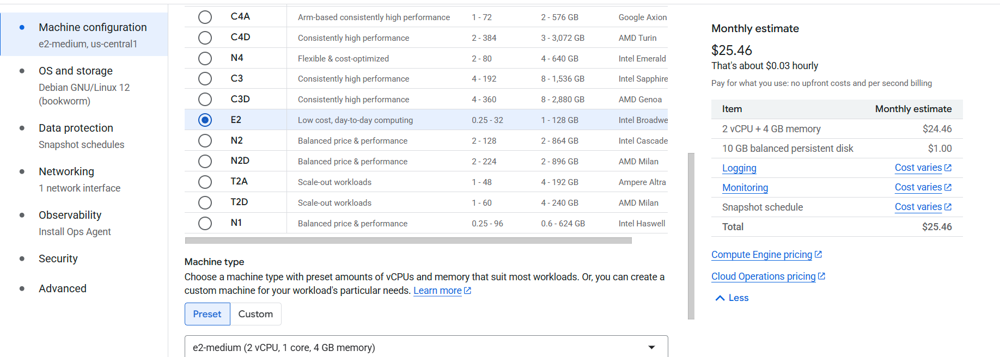
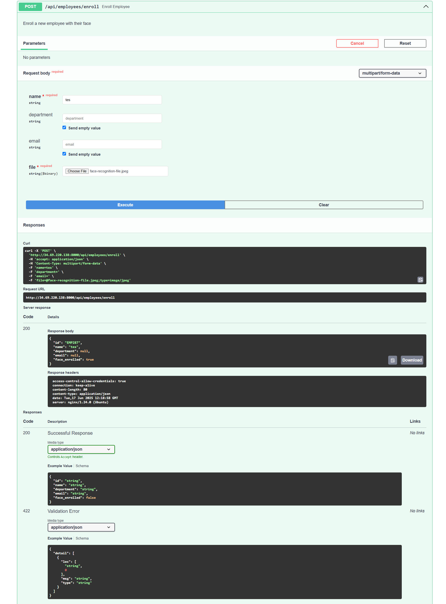
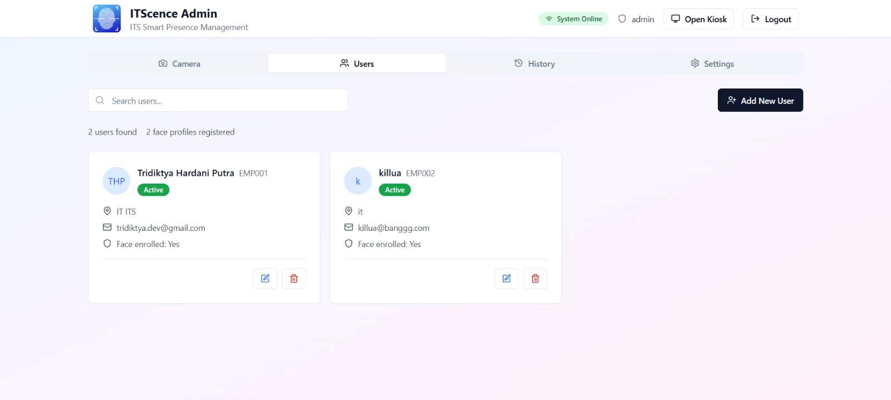

# 📘 Laporan Final Project Teknologi Komputasi Awan

## 👥 Kelompok 1  
**Anggota:**
| NRP | Nama | Tugas |
| ------ | ------ | ------ |
| 5027211032 | Aqila Aqsa | Merancang arsitektur cloud dan testing aplikasi (front-end & back-end) |
| 5027211049 | Tridiktya Hardani Putra | Implementasi/setup arsitektur dan deployment aplikasi |
| 5027221045 | Gilang Raya Kurniawan | Setup Locust dan load testing |
| 5027221063 | Salomo | Setup Locust dan load testing |
| 5027221072 | Zidny Ilman Nafi'an | Setup Locust dan load testing |

---

## 📌 (1) Deskripsi Final Project

Anda adalah seorang lulusan Teknologi Informasi. Sebagai ahli IT, salah satu kemampuan yang harus dimiliki adalah kemampuan merancang, membangun, dan mengelola aplikasi berbasis komputer menggunakan layanan cloud untuk memenuhi kebutuhan organisasi.

Pada suatu saat Anda mendapatkan proyek dari departemen untuk mendeploy sebuah aplikasi **Absen berbasis Face Recognition**, dengan komponen:
- **Backend**: Python FastAPI  
- **Frontend**: ReactJS  

Spesifikasi aplikasi tersedia di repositori berikut:  
🔗 [https://github.com/fuaddary/fp-cloud-2025](https://github.com/fuaddary/fp-cloud-2025)

Anda diminta untuk mendesain arsitektur cloud yang sesuai dengan kebutuhan aplikasi tersebut.  
**Batas anggaran: 100 USD**

---

## ☁️ Lingkungan Cloud yang Dipilih

**Google Cloud Platform (GCP)**

---

## 📝 Tugas dan Penilaian

### 🔹 Arsitektur & Biaya (20%)
- Mendesain arsitektur cloud lengkap
- Menghitung dan menjelaskan estimasi harga VM dan komponen lainnya  
- Dipresentasikan pada minggu ke-15

### 🔹 Implementasi & Deployment (20%)
- Instalasi aplikasi sesuai spesifikasi arsitektur
- Pastikan semua endpoint berjalan dengan baik

### 🔹 Load Testing dengan Locust (35%)
- Fokus pada endpoint `/recognize-face` dalam mode kiosk
- Locust dijalankan dari komputer/host yang berbeda dari aplikasi
- Tujuan pengujian:
  - Menentukan jumlah maksimal pengguna tanpa error
  - Membandingkan jumlah user dengan response time

- **Jumlah user yang diuji:**
  - 1, 3, 5, 10, 15, 20, 30 user

### 🔹 Dokumentasi GitHub (25%)
1. **Introduction**  
   Penjelasan masalah dan latar belakang

2. **Desain Arsitektur Cloud**  
   - Gambar desain arsitektur (dapat menggunakan [https://app.diagrams.net/](https://app.diagrams.net/))  
   - Tabel spesifikasi VM dan estimasi biaya

3. **Langkah Implementasi dan Konfigurasi**  
   - Load balancing  
   - Instalasi `app.py`, MongoDB, dan lainnya  
   - Sertakan screenshot jika memungkinkan

4. **Pengujian API dan Antarmuka**  
   - Uji endpoint aplikasi
   - Tampilkan antarmuka aplikasi

5. **Load Testing & Analisis**  
   - Hasil uji Locust  
   - Analisis performa dan bottleneck

6. **Kesimpulan dan Saran**  
   - Evaluasi akhir proyek  
   - Rekomendasi perbaikan atau optimasi

---

## (2) 📐 Rancangan Arsitektur Cloud

**Diagram Arsitektur V1:**


## 💰 Tabel Perkiraan Biaya Bulanan

| **Komponen**                            | **Jumlah / Unit**      | **Total Bulanan** |
|-----------------------------------------|------------------------|-------------------|
| Compute Engine (e2-small, 2 vCPU, 2GB)  | 1 VM (Load Balancer)   | $13.93            |
| Compute Engine (e2-medium, 2 vCPU, 4GB) | 1 VM (Worker 1)        | $25.46            |
| Compute Engine (e2-medium, 2 vCPU, 4GB) | 1 VM (Worker 2)        | $25.46            |
| Compute Engine (e2-medium, 2 vCPU, 4GB) | 1 VM (Worker 3)        | $25.46            |
| MongoDB Atlas (Free Tier)               | 1 Cluster              | $0.00             |
| **Total**                               |                        | **$90.31**        |

---

**Diagram Arsitektur V2 (Scale-Out Vertikal):**


## 💰 Tabel Perkiraan Biaya Bulanan

| **Komponen**                            | **Jumlah / Unit**      | **Total Bulanan** |
|-----------------------------------------|------------------------|-------------------|
| Compute Engine (e2-small, 2 vCPU, 2GB)  | 1 VM (Load Balancer)   | $13.93            |
| Compute Engine e2-custom-2-4608 (2 vCPUs, 4.5 GB) | 1 VM (Worker 1)        | $42.95           |
| Compute Engine e2-custom-2-4608 (2 vCPUs, 4.5 GB) | 1 VM (Worker 2)        | $42.95           |
| MongoDB Atlas (Free Tier)               | 1 Cluster              | $0.00             |
| **Total**                               |                        | **$99.83**        |

## 🛠️ (3) Implementasi dan Konfigurasi

---

### 🔹 Membuat dan Konfigurasi Instance GCP (Google Compute Engine VM)
#### Memilih Spesifikasi di Compute Engine
   Dilakukan pembuatan dan pemilihan spesifikasi VM untuk load balancer dan worker.

   

#### Konfigurasi Firewall Policy
   Membuat firewall policy untuk mengizinkan traffic HTTP dan HTTPS pada port 80, 443, 8000, dan 9090. Port 80 dan 443 sudah diatur secara default, sehingga hanya perlu menambahkan port 8000 dan 9090 untuk aplikasi.

   

   Dilakukan hal yang sama untuk port 9090.

### 🔹 Setup MongoDB Atlas Cluster
#### Membuat User MongoDB Atlas
   Membuat user MongoDB Atlas dengan role `Read and Write to any database` untuk mengizinkan user/aplikasi melakukan operasi baca dan tulis pada database.

   
#### Membuat Cluster MongoDB Atlas
   Dilakukan pembuatan cluster MongoDB Atlas dengan spesifikasi free.

   

#### Mengatur IP Whitelist
   Mengatur IP whitelist pada MongoDB Atlas untuk mengizinkan akses dari jaringan eksternal.

   

### 🔹 Setup Load Balancer
#### Instalasi Nginx
   Dilakukan instalasi Nginx yang berfungsi sebagai load balancer untuk mendistribusikan traffic ke VM worker. Instalasi dilakukan dengan perintah berikut:

   ```bash
   sudo apt update && sudo apt upgrade -y
   sudo apt install nginx -y
   ```

#### Konfigurasi Nginx
   Setelah instalasi, konfigurasi Nginx dilakukan pada file `/etc/nginx/nginx.conf` untuk mengarahkan traffic ke VM worker.

   ```nginx
   user www-data;
   worker_processes auto;
   pid /run/nginx.pid;
   error_log /var/log/nginx/error.log;
   include /etc/nginx/modules-enabled/*.conf;

   events {
         worker_connections 768;
         # multi_accept on;
   }

   http {
         upstream backend {
                  least_conn;
                  server 10.128.0.3:8000; # IP Internal VM Worker 1
                  server 10.128.0.4:8000;  # IP Internal VM Worker 2
                  server 10.128.0.5:8000;   # IP Internal VM Worker 3
         }

         server {
                  listen 8000;
                  server_name localhost;

                  location / {
                           proxy_pass http://backend;
                  }
         }
         ##
         # Basic Settings
         ##

         sendfile on;
         tcp_nopush on;
         types_hash_max_size 2048;
         # server_tokens off;

         # server_names_hash_bucket_size 64;
         # server_name_in_redirect off;

         include /etc/nginx/mime.types;
         default_type application/octet-stream;

         ##
         # SSL Settings
         ##

         ssl_protocols TLSv1 TLSv1.1 TLSv1.2 TLSv1.3; # Dropping SSLv3, ref: POODLE
         ssl_prefer_server_ciphers on;

         ##
         # Logging Settings
         ##

         access_log /var/log/nginx/access.log;

         ##
         # Gzip Settings
         ##

         gzip on;

         # gzip_vary on;
         # gzip_proxied any;
         # gzip_comp_level 6;
         # gzip_buffers 16 8k;
         # gzip_http_version 1.1;
         # gzip_types text/plain text/css application/json application/javascript text/xml application/xml application/xml+rss text/javascript;

         ##
         # Virtual Host Configs
         ##

         include /etc/nginx/conf.d/*.conf;
         include /etc/nginx/sites-enabled/*;
   }
   ```

### 🔹  Modifikasi Setup dan Konfigurasi Aplikasi
#### Modifikasi Script Dockerfile Front-End
Modifikasi dilakukan pada Dockerfile frontend untuk menambahkan sertifikat SSL dan mengonfigurasi Nginx dari front-end agar dapat diakses dengan HTTPS. Hal ini bertujuan agar kamera dapat dibuka di browser.

```Dockerfile
# FaceAttend Frontend Dockerfile
# ===============================

# Stage 1: Build stage
FROM node:18-alpine AS builder

# Set working directory
WORKDIR /app

# Copy package files
COPY package*.json ./

# Install all dependencies (including devDependencies needed for build)
RUN npm ci

# Copy source code
COPY . .

# Build the application
RUN npm run build

# Stage 2: Production stage
FROM nginx:alpine

# Copy built assets from builder stage
COPY --from=builder /app/dist /usr/share/nginx/html

RUN apk add --no-cache openssl nginx

RUN mkdir -p /etc/ssl/private /etc/ssl/certs && \
    openssl req -x509 -nodes -days 365 -newkey rsa:2048 \
    -keyout /etc/ssl/private/nginx-selfsigned.key \
    -out /etc/ssl/certs/nginx-selfsigned.crt \
    -subj "/C=US/ST=State/L=City/O=Organization/OU=Unit/CN=localhost" && \
    chmod 700 /etc/ssl/private/nginx-selfsigned.key

# Copy custom nginx configuration
COPY nginx.conf /etc/nginx/conf.d/default.conf

# Expose port 443 and 80 (http)
EXPOSE 80 443

# Health check
HEALTHCHECK --interval=30s --timeout=3s --start-period=5s --retries=3 \
    CMD wget --no-verbose --tries=1 --spider http://localhost/ || exit 1

# Start nginx
CMD ["nginx", "-g", "daemon off;"]
```

#### Modifikasi Konfigurasi Nginx untuk Front-End
Hal ini dilakukan untuk memastikan bahwa aplikasi front-end dapat diakses melalui HTTPS dan kamera dapat berfungsi dengan baik di browser.

```nginx
server {
    listen 9090;
    server_name _;
    return 301 https://$host$request_uri;
}

server {
    listen 443 ssl;
    server_name _;

    ssl_certificate /etc/ssl/certs/nginx-selfsigned.crt;
    ssl_certificate_key /etc/ssl/private/nginx-selfsigned.key;

    # Serve static files
    location / {
        root /usr/share/nginx/html;
        index index.html index.htm;
        try_files $uri $uri/ /index.html;
        
        # Security headers
        add_header X-Frame-Options "SAMEORIGIN" always;
        add_header X-Content-Type-Options "nosniff" always;
        add_header X-XSS-Protection "1; mode=block" always;
        
        # Cache static assets
        location ~* \.(js|css|png|jpg|jpeg|gif|ico|svg)$ {
            expires 1y;
            add_header Cache-Control "public, immutable";
        }
    }

    # Proxy API requests to backend
    location /api/ {
        proxy_pass http://backend:8000/api/;
        proxy_set_header Host $host;
        proxy_set_header X-Real-IP $remote_addr;
        proxy_set_header X-Forwarded-For $proxy_add_x_forwarded_for;
        proxy_set_header X-Forwarded-Proto $scheme;
        
        # Handle long requests (face recognition can take time)
        proxy_read_timeout 300s;
        proxy_connect_timeout 75s;
        proxy_send_timeout 300s;
        
        # Handle large file uploads (face images)
        client_max_body_size 10M;
    }

    # Health check endpoint
    location /health {
        proxy_pass http://backend:8000/health;
        proxy_set_header Host $host;
        proxy_set_header X-Real-IP $remote_addr;
    }

    # Error pages
    error_page 404 /index.html;
    error_page 500 502 503 504 /index.html;

    # Gzip compression
    gzip on;
    gzip_vary on;
    gzip_min_length 1024;
    gzip_proxied any;
    gzip_comp_level 6;
    gzip_types
        text/plain
        text/css
        text/xml
        text/javascript
        application/json
        application/javascript
        application/xml+rss
        application/atom+xml
        image/svg+xml;
} 
```

#### Modifikasi .env Back-End
File .env pada backend-example/.env disesuaikan untuk menghubungkan aplikasi dengan MongoDB Atlas yang telah dibuat sebelumnya. `MONGODB_URL` didapatkan dari MongoDB Atlas setelah membuat cluster dan user.

```env
# FaceAttend Backend Configuration
MONGODB_URL=mongodb+srv://admin:<password>@fp-tka.lgrnxza.mongodb.net
DATABASE_NAME=itscence
API_HOST=0.0.0.0
API_PORT=8000
DEFAULT_MODEL=VGG-Face
DEFAULT_DETECTOR=opencv
DEFAULT_DISTANCE_METRIC=cosine
FRONTEND_URL=http://frontend
# Logging
LOG_LEVEL=INFO
```

#### Modifikasi Script docker-compose.yml dan docker-compose.gpu.yml
Modifikasi dilakukan pada file `docker-compose.yml` untuk menyesuaikan dengan perubahan pada Dockerfile dan konfigurasi Nginx. Selain itu, environment pada script ini diubah menjadi `env_file` untuk mengambil konfigurasi dari file `.env` yang telah dibuat sebelumnya. 

```yaml
services:
  # MongoDB Database (Shared between CPU and GPU deployments)
  mongodb:
    image: mongo:7.0
    container_name: itscence-mongodb
    restart: unless-stopped
    environment:
      MONGO_INITDB_ROOT_USERNAME: admin
      MONGO_INITDB_ROOT_PASSWORD: password123
      MONGO_INITDB_DATABASE: itscence
    volumes:
      - mongodb_data:/data/db
      - ./mongodb-init:/docker-entrypoint-initdb.d
    ports:
      - "27017:27017"
    networks:
      - itscence-network
    healthcheck:
      test: ["CMD", "mongosh", "--eval", "db.adminCommand('ping')"]
      interval: 30s
      timeout: 10s
      retries: 3
      start_period: 30s

  # Backend API (CPU version)
  backend:
    build:
      context: ./backend-example
      dockerfile: Dockerfile
    container_name: itscence-backend
    restart: unless-stopped
    env_file:
      - ./backend-example/.env
    volumes:
      - ./backend-example/uploads:/app/uploads
      - ./backend-example/temp_images:/app/temp_images
      - ./backend-example/logs:/app/logs
      - ./backend-example/face_database:/app/face_database
    ports:
      - "8000:8000"
    # depends_on:
    #   mongodb:
    #     condition: service_healthy
    networks:
      - itscence-network
    healthcheck:
      test: ["CMD", "curl", "-f", "http://localhost:8000/health"]
      interval: 30s
      timeout: 10s
      retries: 3
      start_period: 60s

  # Frontend React App
  frontend:
    build:
      context: .
      dockerfile: Dockerfile
    container_name: itscence-frontend
    restart: unless-stopped
    ports:
      - "9090:443"
    depends_on:
      backend:
        condition: service_healthy
    networks:
      - itscence-network
    healthcheck:
      test: ["CMD", "wget", "--no-verbose", "--tries=1", "--spider", "http://localhost/"]
      interval: 30s
      timeout: 3s
      retries: 3
      start_period: 10s

volumes:
  mongodb_data:

networks:
  itscence-network:
    driver: bridge 
```

Setelah menyelesaikan semua modifikasi, dilakukan commit dan push ke [repository GitHub](https://github.com/trdkhardani/fp-cloud-2025/) untuk disimpan

### 🔹 Setup Workers
Setelah memodifikasi script dan konfigurasi, dilakukan setup pada VM worker untuk menjalankan aplikasi backend dan frontend.

#### Clone Repository
Dilakukan clone repository aplikasi ke dalam VM worker dengan perintah berikut:

```bash
git clone https://github.com/trdkhardani/fp-cloud-2025.git
```

#### Instalasi Docker
Instalasi Docker dilakukan pada VM worker untuk menjalankan aplikasi backend dan frontend. Di dalam direktori `/home/username/fp-cloud-2025/` terdapat script `install-docker.sh` yang dapat digunakan untuk menginstal Docker pada VM worker.Isi dari file tersebut adalah sebagai berikut:

```bash
#!/bin/bash

# uninstall all conflicting packages
for pkg in docker.io docker-doc docker-compose docker-compose-v2 podman-docker containerd runc; do sudo apt-get remove $pkg; done

# Add Docker's official GPG key:
sudo apt-get update
sudo apt-get install ca-certificates curl
sudo install -m 0755 -d /etc/apt/keyrings
sudo curl -fsSL https://download.docker.com/linux/ubuntu/gpg -o /etc/apt/keyrings/docker.asc
sudo chmod a+r /etc/apt/keyrings/docker.asc

# Add the repository to Apt sources:
echo \
  "deb [arch=$(dpkg --print-architecture) signed-by=/etc/apt/keyrings/docker.asc] https://download.docker.com/linux/ubuntu \
  $(. /etc/os-release && echo "${UBUNTU_CODENAME:-$VERSION_CODENAME}") stable" | \
  sudo tee /etc/apt/sources.list.d/docker.list > /dev/null
sudo apt-get update

sudo apt-get install docker-ce docker-ce-cli containerd.io docker-buildx-plugin docker-compose-plugin

# Check docker
sudo docker run hello-world
```

#### Mengubah File .env
File `.env` tidak di-commit ke repository, sehingga perlu dibuat secara manual di dalam VM worker. File ini berisi konfigurasi koneksi ke MongoDB Atlas dan pengaturan lainnya. Script dapat dilihat pada bagian [Modifikasi .env Back-End](#modifikasi-env-back-end). File diakses dan diubah dengan menggunakan command `nano /home/username/fp-cloud-2025/backend-example/.env`.

#### Deploy Aplikasi
Setelah semua konfigurasi selesai, aplikasi dapat di-deploy dengan menjalankan perintah berikut di dalam direktori `/home/username/fp-cloud-2025/`:

```bash
./docker-deploy.sh
```

## (4) Pengujian API dan Antarmuka

---

### 🔹 Uji Endpoint Aplikasi

Endpoint backend diuji menggunakan **Swagger UI** (untuk endpoint terdokumentasi) dan **Thunder Client** (untuk endpoint tambahan seperti login admin). Semua endpoint berjalan pada backend FastAPI dan terkoneksi dengan MongoDB di VM worker.

---

### 📘 A. Endpoint yang Diuji via Swagger UI Docs di ```http://34.69.220.138:8000/docs```

### 🔹 Uji Endpoint Aplikasi

#### 1. `GET /api/attendance/mode` – Get Attendance Mode  
> 📸 Swagger UI - Get current attendance mode based on time and schedule

> 

#### 2. `GET /` – Root  
> 📸 Swagger UI - Root Endpoint  

> 

#### 3. `GET /api/config` – Get Config  
> 📸 Swagger UI - Get current DeepFace configuration

> 

#### 4. `POST /api/config` – Update Config  
> 📸 Swagger UI - Update DeepFace configuration 

> 

#### 5. `GET /api/models` – Get Available Models  
> 📸 Swagger UI - Get available DeepFace models and settings

> 

#### 6. `POST /api/recognize-face` – Recognize Face  
> 📸 Swagger UI - Recognize face from uploaded image

> 

#### 7. `POST /api/attendance` – Record Attendance  
> 📸 Swagger UI - Record attendance for an employee with optional captured image 

> 

#### 8. `GET /api/attendance` – Get Attendance History  
> 📸 Swagger UI - Get attendance history with timezone conversion

> 

#### 9. `GET /api/employees` – Get Employees  
> 📸 Swagger UI - Get all employees

> 

#### 10. `POST /api/employees/enroll` – Enroll Employee  
> 📸 Swagger UI - Enroll a new employee with their face

> 

#### 11. `DELETE /api/employees/{employee_id}` – Delete Employee  
> 📸 Swagger UI - Delete an employee and their face data

> 

#### 12. `PUT /api/employees/{employee_id}` – Update Employee  
> 📸 Swagger UI - Update employee information

> 

#### 13. `GET /api/employees/{employee_id}/photo` – Get Employee Photo  
> 📸 Swagger UI - Get employee profile photo

> 

#### 14. `GET /api/attendance/{attendance_id}/photo` – Get Attendance Photo  
> 📸 Swagger UI - Get attendance captured photo

> 
> 

#### 15. `GET /health` – Health Check  
> 📸 Swagger UI - Health check endpoint

> 

#### 16. `POST /api/debug-face` – Debug Face Recognition  
> 📸 Swagger UI - Debug face recognition - shows detailed information about the process

> 

---

### 🖥️ C. Tampilkan Antarmuka Aplikasi

Berikut hasil tangkapan layar (screenshot) antarmuka frontend aplikasi saat digunakan.

> 📸 **1. Halaman Login Admin**

> 

> 📸 **2. Fitur Kamera dan Statistik Admin**

> 

> 📸 **3. Manajemen Karyawan (Users Tab)**

> 

> 📸 **4. Tambah Karyawan - Step 1 (Data)**

> 

> 📸 **5. Tambah Karyawan - Step 2 (Ambil Foto)**

> 

> 📸 **6. Tambah Karyawan - Step 3 (Review Data)**

> 

> 📸 **7. Kiosk Mode**

> 

> 📸 **8. Admin History**

> 

> 📸 **9. Pengaturan Model Face Recognition**       

> 

---

### 📂 Tabel Ringkasan Endpoint

### 📄 Ringkasan Endpoint API

| No. | Method | Endpoint                                | Deskripsi                      |
|-----|--------|------------------------------------------|-------------------------------|
| 1   | GET    | /api/attendance/mode                     | Get Attendance Mode           |
| 2   | GET    | /                                        | Root                          |
| 3   | GET    | /api/config                              | Get Config                    |
| 4   | POST   | /api/config                              | Update Config                 |
| 5   | GET    | /api/models                              | Get Available Models          |
| 6   | POST   | /api/recognize-face                      | Recognize Face                |
| 7   | POST   | /api/attendance                          | Record Attendance             |
| 8   | GET    | /api/attendance                          | Get Attendance History        |
| 9   | GET    | /api/employees                           | Get Employees                 |
| 10  | POST   | /api/employees/enroll                    | Enroll Employee               |
| 11  | DELETE | /api/employees/{employee_id}             | Delete Employee               |
| 12  | PUT    | /api/employees/{employee_id}             | Update Employee               |
| 13  | GET    | /api/employees/{employee_id}/photo       | Get Employee Photo            |
| 14  | GET    | /api/attendance/{attendance_id}/photo    | Get Attendance Photo          |
| 15  | GET    | /health                                  | Health Check                  |
| 16  | POST   | /api/debug-face                          | Debug Face Recognition        |

---

Semua endpoint dan tampilan diuji pada sistem yang sudah dideploy di Google Cloud Platform dengan database MongoDB yang berjalan di VM worker.

# (5) Pengujian Load Testing

Setelah aplikasi berhasil di deploy, kami melakukan pengujian dengna menggunakn locust untuk Menentukan jumlah maksimal pengguna tanpa error Membandingkan jumlah user dengan response time, percobaan dilakukan di alamat API
http://34.69.220.138:8000/api/recognize-face dengan metode POST 

#### 1. Pertama kami melakukan pengujian load Testing dengan menggunakan satu user dan maksimal user adalah satu


DIdapat kesimpulan dari gambar bahwa
   - Server Lancar
   - Response time juga masih lancar

#### 2. Kedua kami melakukan pengujian dengan user sebanyak 5 users


DIdapat kesimpulan dari gambar bahwa:
## 1. Total Requests per Second (RPS) dan Failure Rate

- **RPS (green)**:
  - Stabil di kisaran **0.6 – 0.8 RPS**.
  - Hal ini mengindikasikan bahwa sistem **mampu menangani load dari 5 user** dengan baik.

- **Failures/s (red)**:
  - Tetap di angka **0** sepanjang pengujian.
  - Menunjukkan **tidak ada request yang gagal** – ini merupakan tanda positif.

---

## 2. Response Times (ms)

- **50th Percentile (orange)**:
  - Stabil di **4.000 – 5.500 ms** (4–5.5 detik).
  - Artinya **median response time masih cukup tinggi**, meskipun jumlah user sangat kecil.

- **95th Percentile (purple)**:
  - Berada di kisaran **7.000 – 10.000 ms**.
  - Ini mengindikasikan bahwa sebagian kecil permintaan tetap memerlukan waktu respons yang lebih lama dari rata-rata.


#### 3. Ketiga Percobaan kami menggunakan user sebanyak 10 users


DIdapat kesimpulan bahwa:
## 1. Total Requests per Second (RPS) dan Failure Rate

- **RPS (green)**:
  - Rata-rata berada di angka **0.6 – 0.9 RPS**.
  - Ini tergolong **stabil dan konsisten**, artinya sistem mampu menangani permintaan dengan baik.

- **Failures/s (red)**:
  - Tidak ada lonjakan sama sekali (tetap di **0 failures/s**).
  - Menunjukkan **tidak ada request yang gagal** dalam seluruh pengujian.

---

## 2. Response Times (ms)

- **50th Percentile (orange)**:
  - Median response time berada di kisaran **9.000 – 12.000 ms**.
  - Meskipun terlihat stabil, angka ini cukup tinggi untuk hanya 10 user.

- **95th Percentile (purple)**:
  - Tertinggi mencapai **>18.000 ms** (18 detik), meskipun tetap stabil di kisaran 12.000–16.000 ms.
  - Indikasi bahwa sebagian kecil permintaan mengalami **delay cukup signifikan**.

#### 4. Keempat Percobaan kami menggunakan user sebanyak 15 users


Didapat kesimpulan bahwa
## 1. Total Requests per Second (RPS) dan Failures/s

- **RPS (green line)**:
  - Nilai Requests per Second meningkat dengan cepat dari 0 hingga stabil di kisaran **1.5 requests/s**.
  - Hal ini menunjukkan bahwa sistem mampu menangani permintaan secara konsisten setelah fase pemanasan (ramp-up).

- **Failures/s (red line)**:
  - Terdapat **kegagalan (failures)** yang muncul secara konstan, meskipun jumlahnya kecil.

---

## 2. Response Times (ms)

- **50th Percentile (orange line)**:
  - Rata-rata response time berada di kisaran **6.000–7.000 ms**, yang tergolong **tinggi**.

- **95th Percentile (purple line)**:
  - Di awal pengujian sempat menyentuh **12.000–14.000 ms**, kemudian stabil di kisaran **9.000–11.000 ms**.
  - Ini menandakan bahwa 5% dari request paling lambat memiliki waktu tanggapan yang sangat tinggi — menunjukkan adanya **latensi tinggi** pada sebagian permintaan.

#### 4. Keempat Percobaan kami menggunakan user sebanyak 15 users


Didapat kesimpulan bahwa:
## 1. Total Requests per Second (RPS) dan Failures/s

- **RPS (green line)**:
  - Nilai Requests per Second meningkat dengan cepat dari 0 hingga stabil di kisaran **1.5 requests/s**.
  - Hal ini menunjukkan bahwa sistem mampu menangani permintaan secara konsisten setelah fase pemanasan (ramp-up).

- **Failures/s (red line)**:
  - Terdapat **kegagalan (failures)** yang muncul secara konstan, meskipun jumlahnya kecil.

---

## 2. Response Times (ms)

- **50th Percentile (orange line)**:
  - Rata-rata response time berada di kisaran **6.000–7.000 ms**, yang tergolong **tinggi**.

- **95th Percentile (purple line)**:
  - Di awal pengujian sempat menyentuh **12.000–14.000 ms**, kemudian stabil di kisaran **9.000–11.000 ms**.
  - Ini menandakan bahwa 5% dari request paling lambat memiliki waktu tanggapan yang sangat tinggi — menunjukkan adanya **latensi tinggi** pada sebagian permintaan.

- **Stabilitas**:
  - Meskipun waktu respon terlihat stabil, nilainya masih tergolong lambat

#### 5. Kelima Percobaan kami menggunakan user sebanyak 30 users


Didapat kesimpulan bahwa:
## 1. Total Requests per Second (RPS) dan Failures/s

- **RPS (green line)**:
  - Requests per second naik secara signifikan saat awal uji, lalu stabil di kisaran **1.5–1.7 RPS**.
  - Ini menunjukkan sistem mampu menangani beban dari 30 pengguna secara konsisten tanpa penurunan performa besar.

- **Failures/s (red line)**:
  - Tidak terdapat kegagalan yang terlihat (nilai **Failures/s tetap 0**) selama pengujian.
  - Artinya, sistem berjalan **tanpa error** selama periode pengujian dengan 30 user — ini merupakan indikator **keandalan tinggi**.

---

## 2. Response Times (ms)

- **50th Percentile (orange line)**:
  - Response time berada di kisaran **16.000–18.000 ms** (16–18 detik).
  - Ini menandakan waktu tunggu rata-rata pengguna relatif **lama**, meskipun tidak error.

- **95th Percentile (purple line)**:
  - Nilainya berada di kisaran **20.000–23.000 ms** bahkan sempat menyentuh **25.000 ms**.
  - Ini berarti 5% dari permintaan paling lambat membutuhkan waktu **hingga 25 detik**, yang berpotensi menyebabkan ketidakpuasan pengguna.

- **Kondisi Stabil**:
  - Meskipun tinggi, waktu respon cenderung **stabil** dan tidak menunjukkan lonjakan drastis yang bisa menandakan adanya spike beban.
 
#### 5. Kelima Percobaan kami menggunakan user sebanyak 50 users


Didapat kesimpulan bahwa:
## 1. Total Requests per Second (RPS) dan Failures/s

- **RPS (green line)**:
  - Requests per second meningkat pesat saat awal pengujian dan stabil di kisaran **0.9 – 1.2 RPS**.
  - Terdapat sedikit fluktuasi, namun tetap konsisten dalam menangani request dengan jumlah user yang tinggi.

- **Failures/s (red line)**:
  - Tidak ditemukan adanya kegagalan request selama pengujian (**Failures/s tetap 0**), menunjukkan aplikasi mampu menampung beban tanpa crash/error.

---

## 2. Response Times (ms)

- **50th Percentile (orange line)**:
  - Median response time (waktu respon rata-rata) berkisar antara **35.000 – 45.000 ms** (35–45 detik).
  - Ini menunjukkan adanya **peningkatan signifikan waktu tunggu** dibanding pengujian sebelumnya dengan user lebih sedikit.

- **95th Percentile (purple line)**:
  - Waktu respon 95% dari request menyentuh hingga **60.000 ms**, bahkan sempat mencapai **lebih dari 65.000 ms** di awal pengujian.
  - Artinya, beberapa request memerlukan **lebih dari 1 menit untuk diproses**, yang dapat dianggap sebagai bottleneck kritis.
 
- **Kondisi Umum**:
  - Waktu respon **cenderung tidak stabil**, meskipun perlahan-lahan menjadi lebih rata mendekati akhir pengujian.

#### 6. Keenam Percobaan kami menggunakan user sebanyak 100 users


Didapat kesimpulan bahwa:
## 1. Total Requests per Second (RPS) dan Failures/s

- **RPS (green line)**:
  - Awalnya stabil di kisaran **1–2 RPS**, namun saat traffic meningkat drastis, **RPS justru menurun** dan tidak mampu mencapai performa maksimal.
  - Terlihat ada dua puncak aktivitas, namun keduanya diikuti oleh **penurunan tajam dan stagnasi** pada request rate.

- **Failures/s (red line)**:
  - Muncul lonjakan signifikan pada **jumlah request yang gagal**, terutama setelah menit ke-19:33.
  - Nilainya mencapai **lebih dari 10 failure/s**, yang berarti sistem gagal menangani sebagian besar request pada titik tersebut.

---

## 2. Response Times (ms)

- **50th Percentile (orange line)**:
  - Median response time naik hingga **100.000 ms (100 detik)** sebelum turun drastis.
  - Setelah itu, response time tampak tidak stabil dan beberapa kali menyentuh nilai sangat tinggi lagi.

- **95th Percentile (purple line)**:
  - Waktu respon 95% request mencapai **lebih dari 110.000 ms**, menandakan adanya **bottleneck kritis dan saturasi sistem**.

- **Kondisi Umum**:
  - Respon sangat lambat, banyak fluktuasi, dan **indikasi sistem overload** sangat jelas.
  - Terlihat beberapa kali sistem ‘drop’ (mungkin crash atau timeout).

#### 7. Ketujuh Percobaan kami menggunakan user sebanyak 250 users


Didapat kesimpulan bahwa:
## 1. Total Requests per Second (RPS) dan Failure Rate

- **RPS (green)**:
  - Awalnya berhasil menyentuh sekitar **10–13 RPS**, namun tidak bertahan lama.
  - Terjadi **penurunan drastis dan stagnasi** hingga mendekati 0 RPS di beberapa titik.

- **Failures/s (red)**:
  - Meningkat drastis dan **konsisten tinggi hampir sepanjang tes**.
  - Beberapa titik menunjukkan **lebih dari 20 failures per detik**, mengindikasikan sistem benar-benar **overwhelmed**.

---

## 2. Response Times (ms)

- **50th Percentile (orange)**:
  - Respon time median berada di kisaran **30.000–70.000 ms**, artinya waktu tunggu untuk respon sangat tinggi bahkan untuk request “normal”.

- **95th Percentile (purple)**:
  - Lonjakan hingga **>160.000 ms (160 detik!)** pada beberapa titik.
  - Ini menunjukkan bahwa sebagian besar user mengalami **respons sangat lambat atau timeout**.

- **Kondisi Umum**:
  - Sistem **tidak mampu merespons secara stabil**, bahkan terlihat **respon time tetap tinggi meski RPS rendah**.

